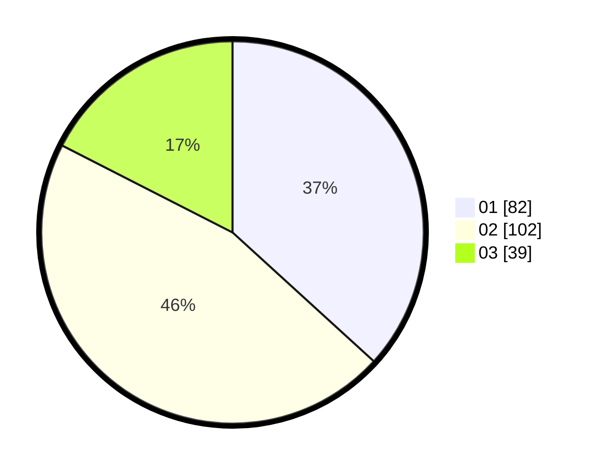

# Hasil

Hasil perolehan suara paslon dapat dilihat pada file paslon-01.txt, paslon-02.txt, dan paslon-03.txt.

Jika tidak ada, artinya data tersebut belum ada pada SIREKAP.

## Perolehan Suara

 * Paslon 01: **82**.
 * Paslon 02: **102**.
 * Paslon 03: **39**.

## Foto C Plano

https://sirekap-obj-formc.kpu.go.id/ee70/pemilu/ppwp/31/75/06/10/01/3175061001289-20240214-211012--a2ad67a9-8870-4d53-be21-7f0247da5fa2.jpg

https://sirekap-obj-formc.kpu.go.id/ee70/pemilu/ppwp/31/75/06/10/01/3175061001289-20240214-211022--78f91050-3b8c-49b0-875f-0bd4bdf93b18.jpg

https://sirekap-obj-formc.kpu.go.id/ee70/pemilu/ppwp/31/75/06/10/01/3175061001289-20240214-211027--72a44dd8-034f-46f1-a392-9dc841436786.jpg

## DATA PEMILIH TETAP

Jumlah pemilih dalam DPT: **271**.
 * L: **140**.
 * P: **131**.

## DATA PENGGUNA HAK PILIH

Jumlah pengguna hak pilih dalam DPT: **224**.
 * L: **115**.
 * P: **109**.

Jumlah pengguna hak pilih dalam DPTb: **0**.
 * L: **0**.
 * P: **0**.

Jumlah pengguna hak pilih dalam DPK: **0**.
 * L: **0**.
 * P: **0**.

Jumlah pengguna hak pilih: **224**.
 * L: **115**.
 * P: **109**.

## JUMLAH SUARA SAH DAN TIDAK SAH

JUMLAH SELURUH SUARA SAH: **223**.

JUMLAH SUARA TIDAK SAH: **1**.

JUMLAH SELURUH SUARA SAH DAN SUARA TIDAK SAH: **224**.
