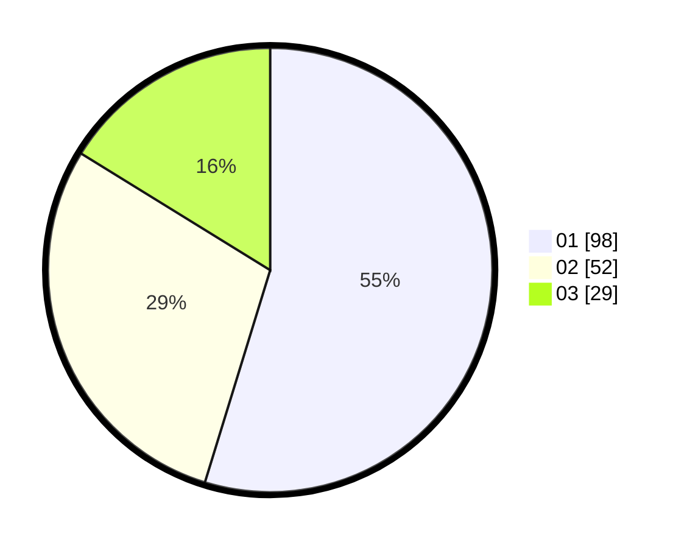

# Hasil

Hasil perolehan suara paslon dapat dilihat pada file paslon-01.txt, paslon-02.txt, dan paslon-03.txt.

Jika tidak ada, artinya data tersebut belum ada pada SIREKAP.

## Perolehan Suara

 * Paslon 01: **98**.
 * Paslon 02: **52**.
 * Paslon 03: **29**.

## Foto C Plano

https://sirekap-obj-formc.kpu.go.id/6b2e/pemilu/ppwp/31/75/06/10/01/3175061001292-20240214-210450--cd05f153-e0b7-4581-8835-6db1eed2058c.jpg

https://sirekap-obj-formc.kpu.go.id/6b2e/pemilu/ppwp/31/75/06/10/01/3175061001292-20240214-210607--4764f3b0-c01d-446c-886b-5040e8acf253.jpg

https://sirekap-obj-formc.kpu.go.id/6b2e/pemilu/ppwp/31/75/06/10/01/3175061001292-20240215-000743--d937015a-a435-4f4a-99ac-9586df94559d.jpg
