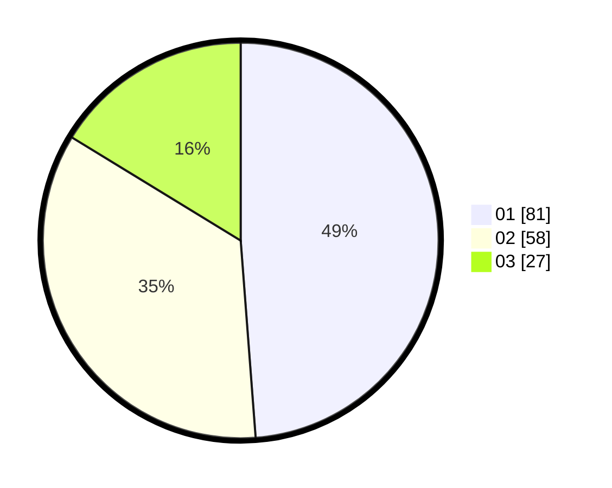

# Hasil

Hasil perolehan suara paslon dapat dilihat pada file paslon-01.txt, paslon-02.txt, dan paslon-03.txt.

Jika tidak ada, artinya data tersebut belum ada pada SIREKAP.

## Perolehan Suara

 * Paslon 01: **81**.
 * Paslon 02: **58**.
 * Paslon 03: **27**.

## Foto C Plano

https://sirekap-obj-formc.kpu.go.id/d0e7/pemilu/ppwp/31/75/06/10/01/3175061001293-20240214-202157--d4dc3737-59c8-474b-b32a-0f5d0004320b.jpg

https://sirekap-obj-formc.kpu.go.id/d0e7/pemilu/ppwp/31/75/06/10/01/3175061001293-20240214-202251--320341f5-a9c0-47c9-b887-8cc61115a6da.jpg

https://sirekap-obj-formc.kpu.go.id/d0e7/pemilu/ppwp/31/75/06/10/01/3175061001293-20240214-202402--be2999c6-57f3-4cb7-9d61-52324877a2db.jpg

## DATA PEMILIH TETAP

Jumlah pemilih dalam DPT: **246**.
 * L: **120**.
 * P: **126**.

## DATA PENGGUNA HAK PILIH

Jumlah pengguna hak pilih dalam DPT: **166**.
 * L: **76**.
 * P: **90**.

Jumlah pengguna hak pilih dalam DPTb: **1**.
 * L: **1**.
 * P: **0**.

Jumlah pengguna hak pilih dalam DPK: **0**.
 * L: **0**.
 * P: **0**.

Jumlah pengguna hak pilih: **167**.
 * L: **77**.
 * P: **90**.

## JUMLAH SUARA SAH DAN TIDAK SAH

JUMLAH SELURUH SUARA SAH: **166**.

JUMLAH SUARA TIDAK SAH: **1**.

JUMLAH SELURUH SUARA SAH DAN SUARA TIDAK SAH: **167**.
