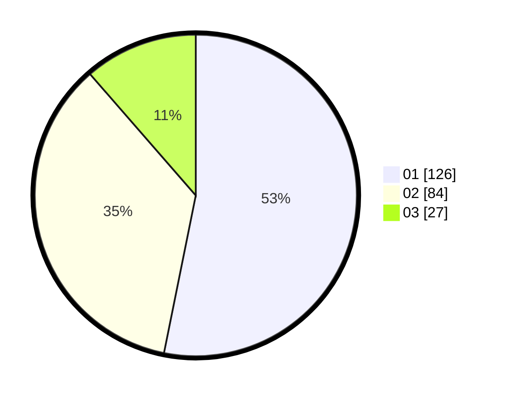

# Hasil

Hasil perolehan suara paslon dapat dilihat pada file paslon-01.txt, paslon-02.txt, dan paslon-03.txt.

Jika tidak ada, artinya data tersebut belum ada pada SIREKAP.

## Perolehan Suara

 * Paslon 01: **126**.
 * Paslon 02: **84**.
 * Paslon 03: **27**.

## Foto C Plano

https://sirekap-obj-formc.kpu.go.id/1380/pemilu/ppwp/31/75/06/10/02/3175061002001-20240215-132234--a04ee856-928e-4fd2-924d-eff26384ea68.jpg

https://sirekap-obj-formc.kpu.go.id/1380/pemilu/ppwp/31/75/06/10/02/3175061002001-20240215-132318--525dc6b4-8da5-4135-81ea-d5656faad6a1.jpg

https://sirekap-obj-formc.kpu.go.id/1380/pemilu/ppwp/31/75/06/10/02/3175061002001-20240215-132351--e711e7f9-41f5-41cd-9497-017e6f6a95eb.jpg
