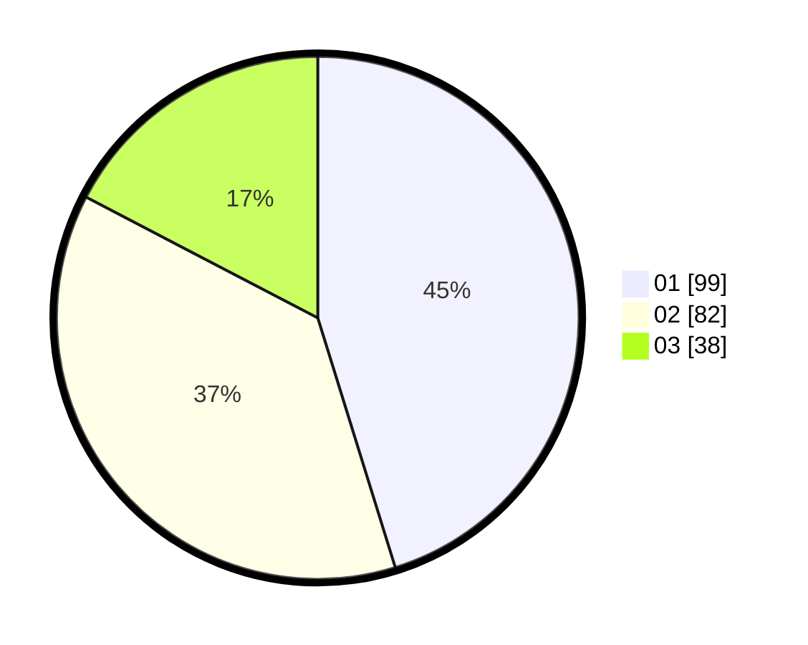

# Hasil

Hasil perolehan suara paslon dapat dilihat pada file paslon-01.txt, paslon-02.txt, dan paslon-03.txt.

Jika tidak ada, artinya data tersebut belum ada pada SIREKAP.

## Perolehan Suara

 * Paslon 01: **99**.
 * Paslon 02: **82**.
 * Paslon 03: **38**.

## Foto C Plano

https://sirekap-obj-formc.kpu.go.id/c00e/pemilu/ppwp/31/75/06/10/02/3175061002004-20240214-232627--ba6822c1-eadf-4a55-a1c9-8dc35c357e96.jpg

https://sirekap-obj-formc.kpu.go.id/c00e/pemilu/ppwp/31/75/06/10/02/3175061002004-20240216-093207--106930e3-4195-4ac3-8551-6331c8b6f59c.jpg

https://sirekap-obj-formc.kpu.go.id/c00e/pemilu/ppwp/31/75/06/10/02/3175061002004-20240215-011529--ff8b764d-4630-4818-b31b-66ddc9319232.jpg

## DATA PEMILIH TETAP

Jumlah pemilih dalam DPT: **291**.
 * L: **146**.
 * P: **145**.

## DATA PENGGUNA HAK PILIH

Jumlah pengguna hak pilih dalam DPT: **221**.
 * L: **110**.
 * P: **111**.

Jumlah pengguna hak pilih dalam DPTb: **2**.
 * L: **1**.
 * P: **1**.

Jumlah pengguna hak pilih dalam DPK: **0**.
 * L: **0**.
 * P: **0**.

Jumlah pengguna hak pilih: **223**.
 * L: **111**.
 * P: **112**.

## JUMLAH SUARA SAH DAN TIDAK SAH

JUMLAH SELURUH SUARA SAH: **219**.

JUMLAH SUARA TIDAK SAH: **4**.

JUMLAH SELURUH SUARA SAH DAN SUARA TIDAK SAH: **223**.
