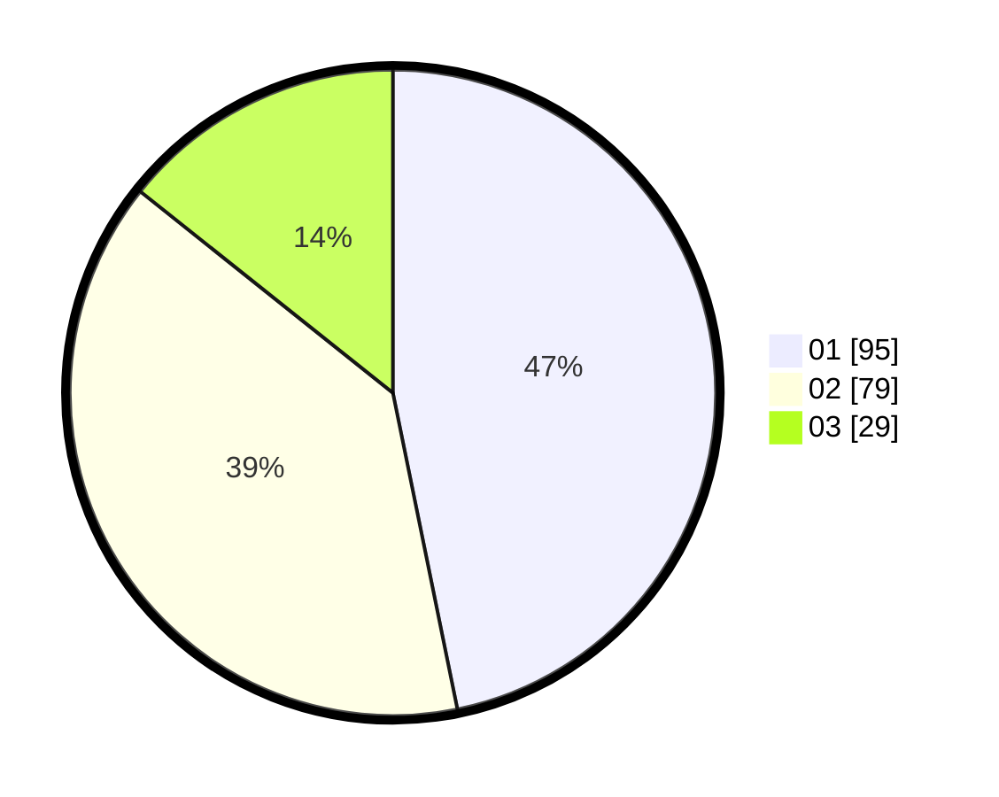

# Hasil

Hasil perolehan suara paslon dapat dilihat pada file paslon-01.txt, paslon-02.txt, dan paslon-03.txt.

Jika tidak ada, artinya data tersebut belum ada pada SIREKAP.

## Perolehan Suara

 * Paslon 01: **95**.
 * Paslon 02: **79**.
 * Paslon 03: **29**.

## Foto C Plano

https://sirekap-obj-formc.kpu.go.id/c585/pemilu/ppwp/31/75/06/10/02/3175061002005-20240215-004051--67c8c5d0-f5ef-4111-aed8-5924b2c4a1a9.jpg

https://sirekap-obj-formc.kpu.go.id/c585/pemilu/ppwp/31/75/06/10/02/3175061002005-20240215-004254--5f1521b8-197a-4beb-9e6d-5d7a4e5ad477.jpg
