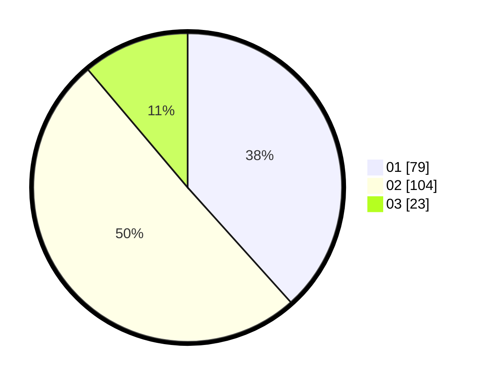

# Hasil

Hasil perolehan suara paslon dapat dilihat pada file paslon-01.txt, paslon-02.txt, dan paslon-03.txt.

Jika tidak ada, artinya data tersebut belum ada pada SIREKAP.

## Perolehan Suara

 * Paslon 01: **79**.
 * Paslon 02: **104**.
 * Paslon 03: **23**.

## Foto C Plano

https://sirekap-obj-formc.kpu.go.id/9513/pemilu/ppwp/31/75/06/10/02/3175061002008-20240214-230722--59fd916b-44a6-484b-9501-d3632bdbb790.jpg

https://sirekap-obj-formc.kpu.go.id/9513/pemilu/ppwp/31/75/06/10/02/3175061002008-20240214-230802--2fd7c93d-1031-49de-8282-34f8ba85b961.jpg

https://sirekap-obj-formc.kpu.go.id/9513/pemilu/ppwp/31/75/06/10/02/3175061002008-20240214-231041--9c555330-393e-48bf-a2ff-ca556c940e40.jpg
