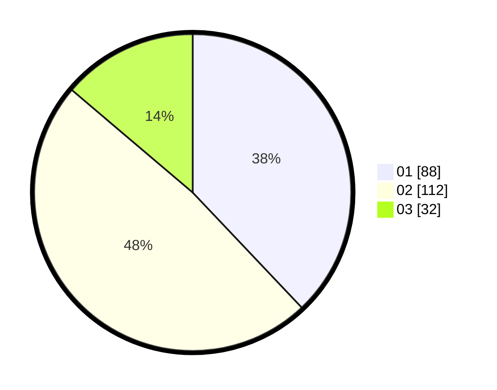

# Hasil

Hasil perolehan suara paslon dapat dilihat pada file paslon-01.txt, paslon-02.txt, dan paslon-03.txt.

Jika tidak ada, artinya data tersebut belum ada pada SIREKAP.

## Perolehan Suara

 * Paslon 01: **88**.
 * Paslon 02: **112**.
 * Paslon 03: **32**.

## Foto C Plano

https://sirekap-obj-formc.kpu.go.id/e77c/pemilu/ppwp/31/75/06/10/02/3175061002013-20240215-015337--6e9b77d7-1ce4-480f-8730-69564fcde8bb.jpg

https://sirekap-obj-formc.kpu.go.id/e77c/pemilu/ppwp/31/75/06/10/02/3175061002013-20240215-015434--13736e37-1d41-4242-9a3e-5974c5941723.jpg
