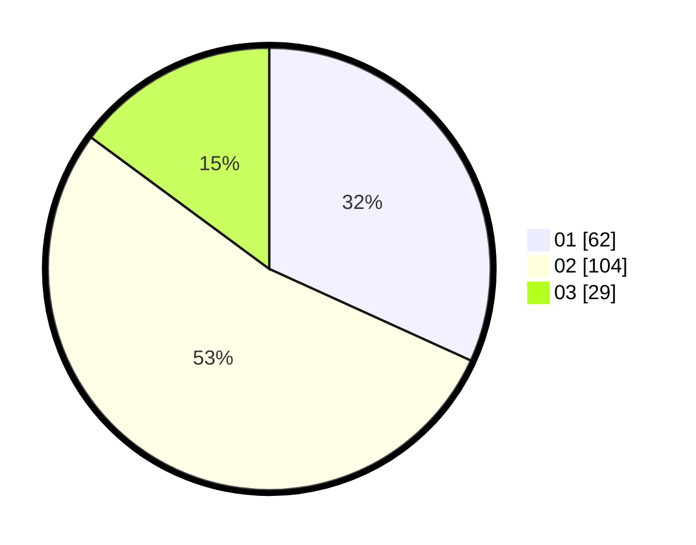

# Hasil

Hasil perolehan suara paslon dapat dilihat pada file paslon-01.txt, paslon-02.txt, dan paslon-03.txt.

Jika tidak ada, artinya data tersebut belum ada pada SIREKAP.

## Perolehan Suara

 * Paslon 01: **62**.
 * Paslon 02: **104**.
 * Paslon 03: **29**.

## Foto C Plano

https://sirekap-obj-formc.kpu.go.id/1780/pemilu/ppwp/31/75/06/10/02/3175061002019-20240215-020046--4503e27e-8eea-4801-ae9a-56fa70e23ce9.jpg

https://sirekap-obj-formc.kpu.go.id/1780/pemilu/ppwp/31/75/06/10/02/3175061002019-20240215-084928--92189761-17c2-42f5-b402-a6e20a090d5c.jpg

https://sirekap-obj-formc.kpu.go.id/1780/pemilu/ppwp/31/75/06/10/02/3175061002019-20240215-020624--27a249c5-829d-404d-ab67-2690b73a1d9a.jpg
