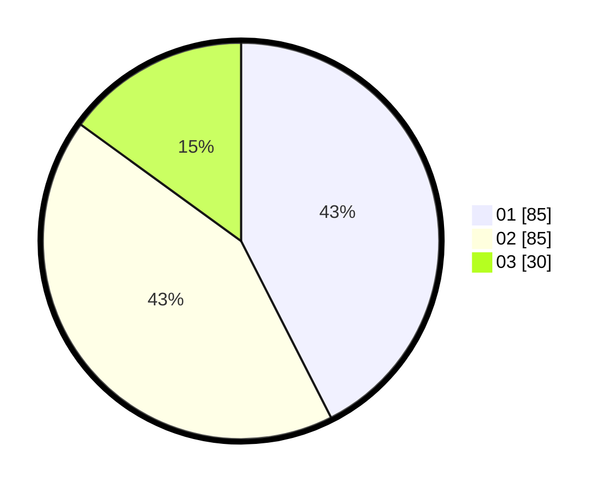

# Hasil

Hasil perolehan suara paslon dapat dilihat pada file paslon-01.txt, paslon-02.txt, dan paslon-03.txt.

Jika tidak ada, artinya data tersebut belum ada pada SIREKAP.

## Perolehan Suara

 * Paslon 01: **85**.
 * Paslon 02: **85**.
 * Paslon 03: **30**.

## Foto C Plano

https://sirekap-obj-formc.kpu.go.id/f9d5/pemilu/ppwp/31/75/06/10/02/3175061002021-20240215-003033--bef162a4-7d7c-4605-96dd-efd8cd73ddca.jpg

https://sirekap-obj-formc.kpu.go.id/f9d5/pemilu/ppwp/31/75/06/10/02/3175061002021-20240215-003227--59f3fb5a-f1f3-433b-a584-a955c913b27a.jpg
