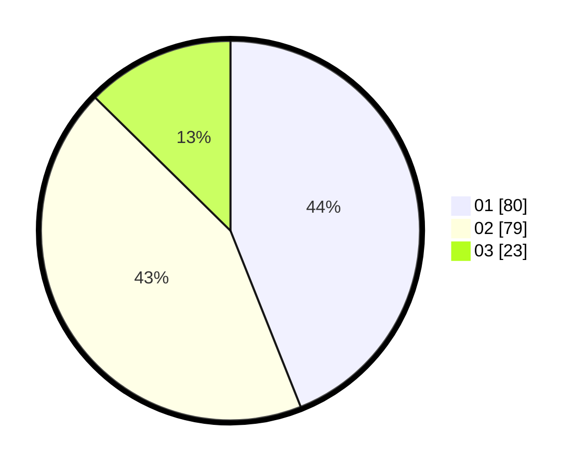

# Hasil

Hasil perolehan suara paslon dapat dilihat pada file paslon-01.txt, paslon-02.txt, dan paslon-03.txt.

Jika tidak ada, artinya data tersebut belum ada pada SIREKAP.

## Perolehan Suara

 * Paslon 01: **80**.
 * Paslon 02: **79**.
 * Paslon 03: **23**.

## Foto C Plano

https://sirekap-obj-formc.kpu.go.id/1ead/pemilu/ppwp/31/75/06/10/02/3175061002022-20240214-235857--ed17da24-cecf-48f0-8ce0-7a67178a3926.jpg

https://sirekap-obj-formc.kpu.go.id/1ead/pemilu/ppwp/31/75/06/10/02/3175061002022-20240215-001057--e090b2c9-5051-4b03-8d6e-78f7d33ff7be.jpg

https://sirekap-obj-formc.kpu.go.id/1ead/pemilu/ppwp/31/75/06/10/02/3175061002022-20240215-001252--47a8179b-5692-4a51-9804-a7969971f5de.jpg
