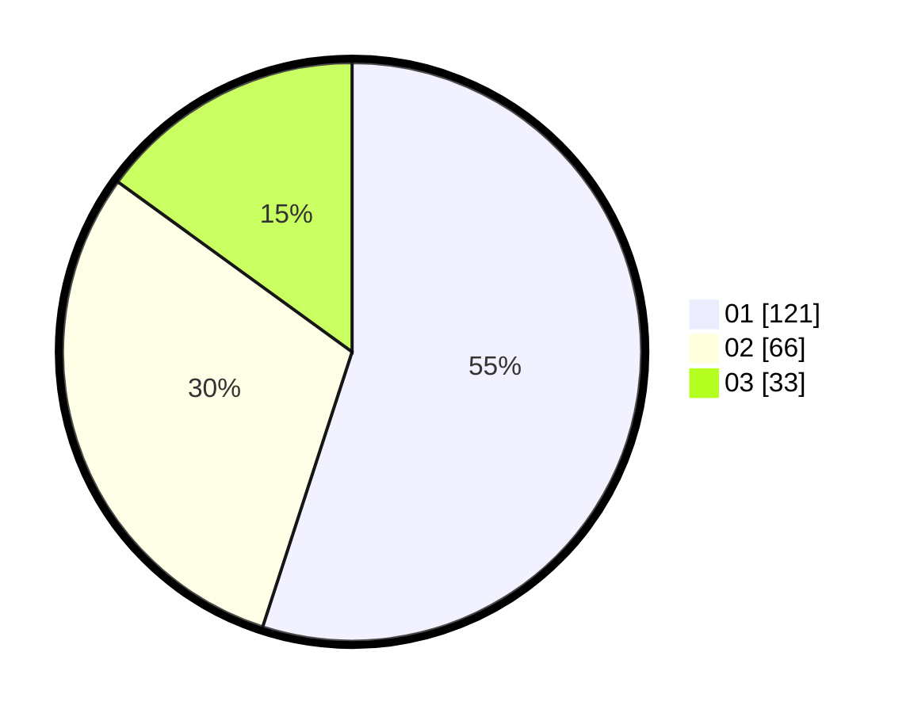

# Hasil

Hasil perolehan suara paslon dapat dilihat pada file paslon-01.txt, paslon-02.txt, dan paslon-03.txt.

Jika tidak ada, artinya data tersebut belum ada pada SIREKAP.

## Perolehan Suara

 * Paslon 01: **121**.
 * Paslon 02: **66**.
 * Paslon 03: **33**.

## Foto C Plano

https://sirekap-obj-formc.kpu.go.id/590c/pemilu/ppwp/31/75/06/10/02/3175061002025-20240214-204440--a79b9632-6388-40b5-aa46-3b97463251c9.jpg

https://sirekap-obj-formc.kpu.go.id/590c/pemilu/ppwp/31/75/06/10/02/3175061002025-20240214-204658--9fc60a29-4ccc-4169-a257-f90606dea453.jpg

https://sirekap-obj-formc.kpu.go.id/590c/pemilu/ppwp/31/75/06/10/02/3175061002025-20240214-204901--4e73ff4f-7c63-4760-938a-a3dc7002efe6.jpg

## DATA PEMILIH TETAP

Jumlah pemilih dalam DPT: **268**.
 * L: **143**.
 * P: **125**.

## DATA PENGGUNA HAK PILIH

Jumlah pengguna hak pilih dalam DPT: **221**.
 * L: **114**.
 * P: **107**.

Jumlah pengguna hak pilih dalam DPTb: **4**.
 * L: **3**.
 * P: **1**.

Jumlah pengguna hak pilih dalam DPK: **1**.
 * L: **0**.
 * P: **1**.

Jumlah pengguna hak pilih: **226**.
 * L: **117**.
 * P: **109**.

## JUMLAH SUARA SAH DAN TIDAK SAH

JUMLAH SELURUH SUARA SAH: **220**.

JUMLAH SUARA TIDAK SAH: **6**.

JUMLAH SELURUH SUARA SAH DAN SUARA TIDAK SAH: **226**.
