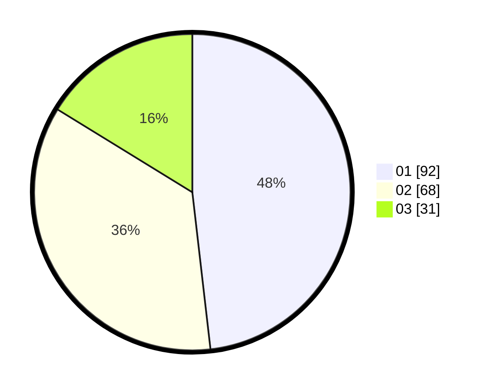

# Hasil

Hasil perolehan suara paslon dapat dilihat pada file paslon-01.txt, paslon-02.txt, dan paslon-03.txt.

Jika tidak ada, artinya data tersebut belum ada pada SIREKAP.

## Perolehan Suara

 * Paslon 01: **92**.
 * Paslon 02: **68**.
 * Paslon 03: **31**.

## Foto C Plano

https://sirekap-obj-formc.kpu.go.id/1607/pemilu/ppwp/31/75/06/10/02/3175061002028-20240215-030535--5c25ddad-fcf5-4e8f-a582-491c459dee68.jpg

https://sirekap-obj-formc.kpu.go.id/1607/pemilu/ppwp/31/75/06/10/02/3175061002028-20240215-030655--0122e823-dc43-47a3-a4d2-9199323a4e95.jpg

https://sirekap-obj-formc.kpu.go.id/1607/pemilu/ppwp/31/75/06/10/02/3175061002028-20240215-030857--f77d25e4-77fe-41d8-af2f-c8ef07628017.jpg
