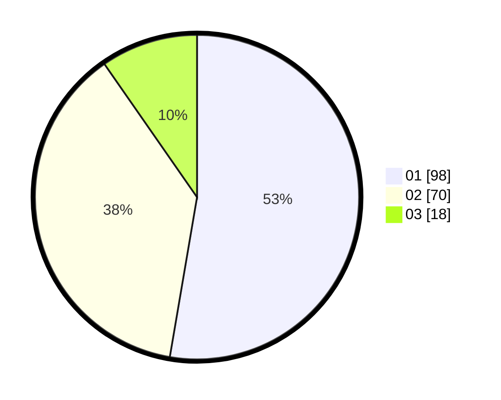

# Hasil

Hasil perolehan suara paslon dapat dilihat pada file paslon-01.txt, paslon-02.txt, dan paslon-03.txt.

Jika tidak ada, artinya data tersebut belum ada pada SIREKAP.

## Perolehan Suara

 * Paslon 01: **98**.
 * Paslon 02: **70**.
 * Paslon 03: **18**.

## Foto C Plano

https://sirekap-obj-formc.kpu.go.id/9b0c/pemilu/ppwp/31/75/06/10/02/3175061002033-20240214-155057--36810ed2-e40c-4737-9293-5defb8f3b384.jpg

https://sirekap-obj-formc.kpu.go.id/9b0c/pemilu/ppwp/31/75/06/10/02/3175061002033-20240215-095446--35f503ac-0194-4c62-b531-e50c93ce826f.jpg

https://sirekap-obj-formc.kpu.go.id/9b0c/pemilu/ppwp/31/75/06/10/02/3175061002033-20240215-020002--a4744ee2-feb8-471d-9dfc-964001813527.jpg

## DATA PEMILIH TETAP

Jumlah pemilih dalam DPT: **243**.
 * L: **124**.
 * P: **119**.

## DATA PENGGUNA HAK PILIH

Jumlah pengguna hak pilih dalam DPT: **188**.
 * L: **94**.
 * P: **94**.

Jumlah pengguna hak pilih dalam DPTb: **0**.
 * L: **0**.
 * P: **0**.

Jumlah pengguna hak pilih dalam DPK: **1**.
 * L: **1**.
 * P: **0**.

Jumlah pengguna hak pilih: **189**.
 * L: **95**.
 * P: **94**.

## JUMLAH SUARA SAH DAN TIDAK SAH

JUMLAH SELURUH SUARA SAH: **186**.

JUMLAH SUARA TIDAK SAH: **3**.

JUMLAH SELURUH SUARA SAH DAN SUARA TIDAK SAH: **189**.
