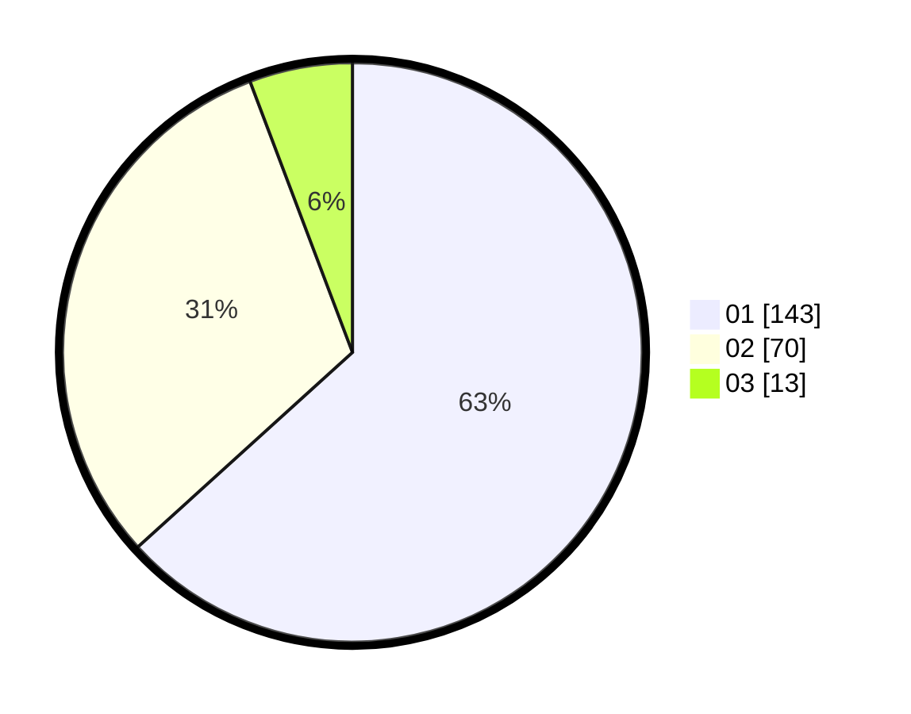

# Hasil

Hasil perolehan suara paslon dapat dilihat pada file paslon-01.txt, paslon-02.txt, dan paslon-03.txt.

Jika tidak ada, artinya data tersebut belum ada pada SIREKAP.

## Perolehan Suara

 * Paslon 01: **143**.
 * Paslon 02: **70**.
 * Paslon 03: **13**.

## Foto C Plano

https://sirekap-obj-formc.kpu.go.id/3069/pemilu/ppwp/31/75/06/10/02/3175061002035-20240215-002715--6f145deb-6e14-43f5-8a1d-8de55dbb13f2.jpg

https://sirekap-obj-formc.kpu.go.id/3069/pemilu/ppwp/31/75/06/10/02/3175061002035-20240215-002852--97a5eb7f-700c-4e2a-8027-12a171c897c6.jpg

https://sirekap-obj-formc.kpu.go.id/3069/pemilu/ppwp/31/75/06/10/02/3175061002035-20240215-004817--22d93b76-d77e-4ba8-9886-42e389822340.jpg
