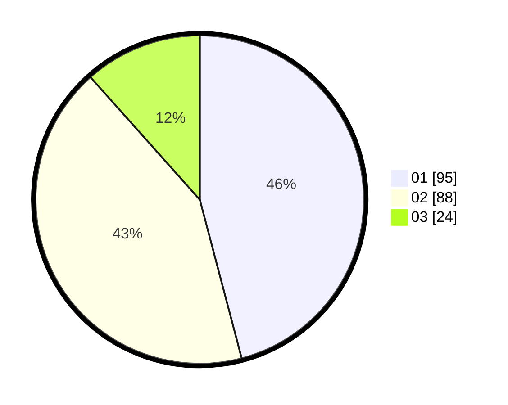

# Hasil

Hasil perolehan suara paslon dapat dilihat pada file paslon-01.txt, paslon-02.txt, dan paslon-03.txt.

Jika tidak ada, artinya data tersebut belum ada pada SIREKAP.

## Perolehan Suara

 * Paslon 01: **95**.
 * Paslon 02: **88**.
 * Paslon 03: **24**.

## Foto C Plano

https://sirekap-obj-formc.kpu.go.id/1b22/pemilu/ppwp/31/75/06/10/02/3175061002039-20240214-194106--af9ec0f6-a6e0-40ff-828d-006d9bc3eeea.jpg

https://sirekap-obj-formc.kpu.go.id/1b22/pemilu/ppwp/31/75/06/10/02/3175061002039-20240214-193900--3afb7255-9c90-4289-8912-a64c158a0a04.jpg

https://sirekap-obj-formc.kpu.go.id/1b22/pemilu/ppwp/31/75/06/10/02/3175061002039-20240214-222918--daeedca1-80e3-4b88-83d2-41008752ea42.jpg

## DATA PEMILIH TETAP

Jumlah pemilih dalam DPT: **290**.
 * L: **149**.
 * P: **141**.

## DATA PENGGUNA HAK PILIH

Jumlah pengguna hak pilih dalam DPT: **214**.
 * L: **102**.
 * P: **112**.

Jumlah pengguna hak pilih dalam DPTb: **0**.
 * L: **0**.
 * P: **0**.

Jumlah pengguna hak pilih dalam DPK: **1**.
 * L: **0**.
 * P: **1**.

Jumlah pengguna hak pilih: **215**.
 * L: **102**.
 * P: **113**.

## JUMLAH SUARA SAH DAN TIDAK SAH

JUMLAH SELURUH SUARA SAH: **207**.

JUMLAH SUARA TIDAK SAH: **8**.

JUMLAH SELURUH SUARA SAH DAN SUARA TIDAK SAH: **215**.
