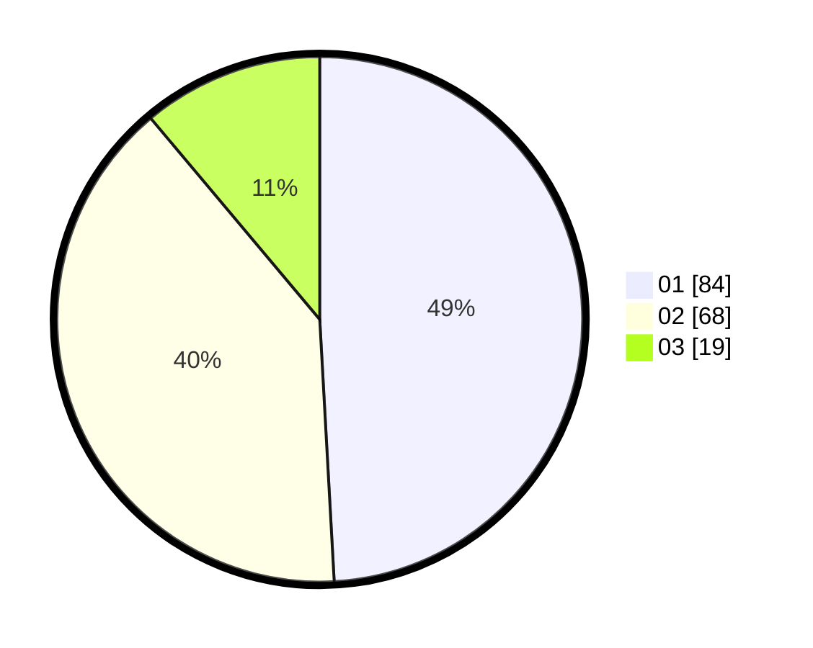

# Hasil

Hasil perolehan suara paslon dapat dilihat pada file paslon-01.txt, paslon-02.txt, dan paslon-03.txt.

Jika tidak ada, artinya data tersebut belum ada pada SIREKAP.

## Perolehan Suara

 * Paslon 01: **84**.
 * Paslon 02: **68**.
 * Paslon 03: **19**.

## Foto C Plano

https://sirekap-obj-formc.kpu.go.id/17fc/pemilu/ppwp/31/75/06/10/02/3175061002040-20240215-004354--6f89edac-3409-416a-8c98-2ecafca790a5.jpg

https://sirekap-obj-formc.kpu.go.id/17fc/pemilu/ppwp/31/75/06/10/02/3175061002040-20240215-004523--ad286707-ae9c-480c-8831-c3371d169255.jpg

https://sirekap-obj-formc.kpu.go.id/17fc/pemilu/ppwp/31/75/06/10/02/3175061002040-20240215-005445--e310a2ca-a677-4356-905c-888f8a0af4ef.jpg
