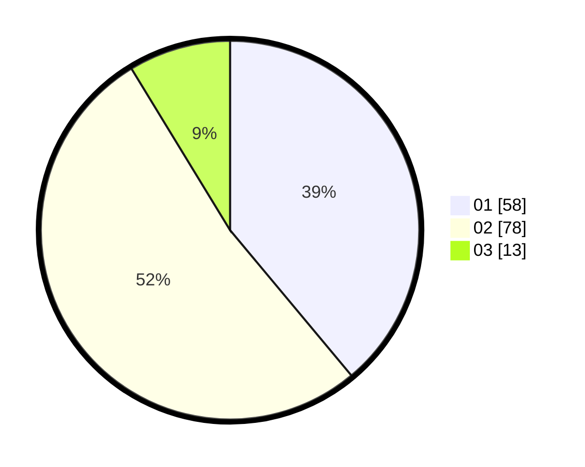

# Hasil

Hasil perolehan suara paslon dapat dilihat pada file paslon-01.txt, paslon-02.txt, dan paslon-03.txt.

Jika tidak ada, artinya data tersebut belum ada pada SIREKAP.

## Perolehan Suara

 * Paslon 01: **58**.
 * Paslon 02: **78**.
 * Paslon 03: **13**.

## Foto C Plano

https://sirekap-obj-formc.kpu.go.id/414f/pemilu/ppwp/31/75/06/10/02/3175061002041-20240215-062334--851db5d6-41e9-43b3-8826-03adbdb90602.jpg

https://sirekap-obj-formc.kpu.go.id/414f/pemilu/ppwp/31/75/06/10/02/3175061002041-20240215-062453--f99c6e5e-78b0-4fa7-b4c7-0298dcfc795c.jpg

https://sirekap-obj-formc.kpu.go.id/414f/pemilu/ppwp/31/75/06/10/02/3175061002041-20240215-062558--4c77626b-ebc5-4c7b-a7e3-74b32f88972e.jpg
