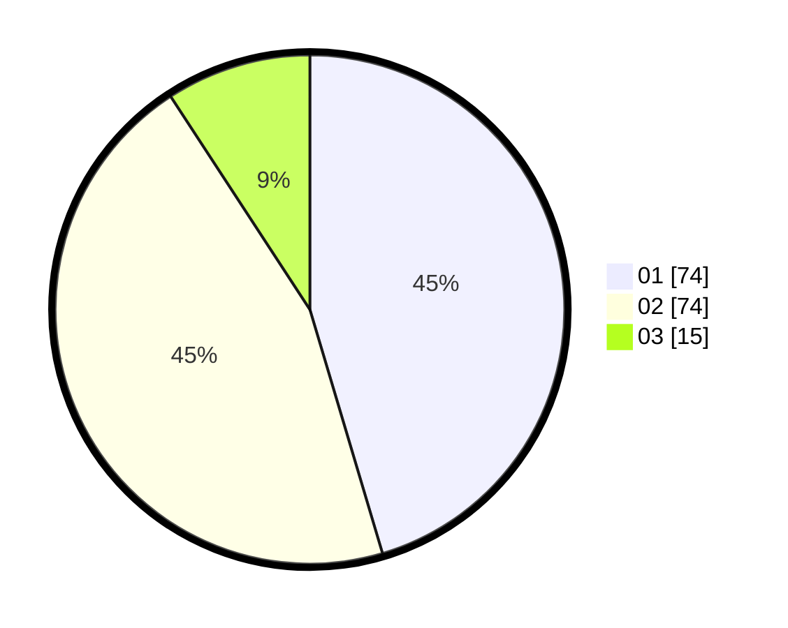

# Hasil

Hasil perolehan suara paslon dapat dilihat pada file paslon-01.txt, paslon-02.txt, dan paslon-03.txt.

Jika tidak ada, artinya data tersebut belum ada pada SIREKAP.

## Perolehan Suara

 * Paslon 01: **74**.
 * Paslon 02: **74**.
 * Paslon 03: **15**.

## Foto C Plano

https://sirekap-obj-formc.kpu.go.id/4c65/pemilu/ppwp/31/75/06/10/02/3175061002042-20240214-213959--1e4e4de8-fb5f-4fcd-9f05-461dde49a8de.jpg

https://sirekap-obj-formc.kpu.go.id/4c65/pemilu/ppwp/31/75/06/10/02/3175061002042-20240214-214036--5697cf1b-71b0-4547-987c-0f62d940f065.jpg

https://sirekap-obj-formc.kpu.go.id/4c65/pemilu/ppwp/31/75/06/10/02/3175061002042-20240214-214945--817140d1-e303-4b72-983e-4218521756bd.jpg
