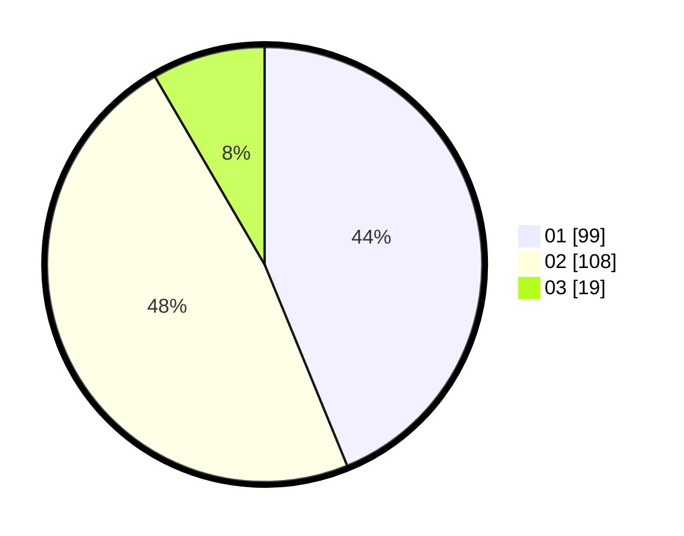

# Hasil

Hasil perolehan suara paslon dapat dilihat pada file paslon-01.txt, paslon-02.txt, dan paslon-03.txt.

Jika tidak ada, artinya data tersebut belum ada pada SIREKAP.

## Perolehan Suara

 * Paslon 01: **99**.
 * Paslon 02: **108**.
 * Paslon 03: **19**.

## Foto C Plano

https://sirekap-obj-formc.kpu.go.id/6780/pemilu/ppwp/31/75/06/10/02/3175061002045-20240216-004756--2a97f7fe-a42c-4e7b-a2cd-f1c3cb62ec34.jpg

https://sirekap-obj-formc.kpu.go.id/6780/pemilu/ppwp/31/75/06/10/02/3175061002045-20240216-004808--398cad70-d0b0-4dee-ae0f-0e5a89043bd6.jpg

https://sirekap-obj-formc.kpu.go.id/6780/pemilu/ppwp/31/75/06/10/02/3175061002045-20240216-004802--95dbfd25-c643-43dc-8563-569f3ef07dda.jpg

## DATA PEMILIH TETAP

Jumlah pemilih dalam DPT: **290**.
 * L: **153**.
 * P: **137**.

## DATA PENGGUNA HAK PILIH

Jumlah pengguna hak pilih dalam DPT: **227**.
 * L: **114**.
 * P: **113**.

Jumlah pengguna hak pilih dalam DPTb: **0**.
 * L: **0**.
 * P: **0**.

Jumlah pengguna hak pilih dalam DPK: **0**.
 * L: **0**.
 * P: **0**.

Jumlah pengguna hak pilih: **227**.
 * L: **114**.
 * P: **113**.

## JUMLAH SUARA SAH DAN TIDAK SAH

JUMLAH SELURUH SUARA SAH: **226**.

JUMLAH SUARA TIDAK SAH: **1**.

JUMLAH SELURUH SUARA SAH DAN SUARA TIDAK SAH: **227**.
