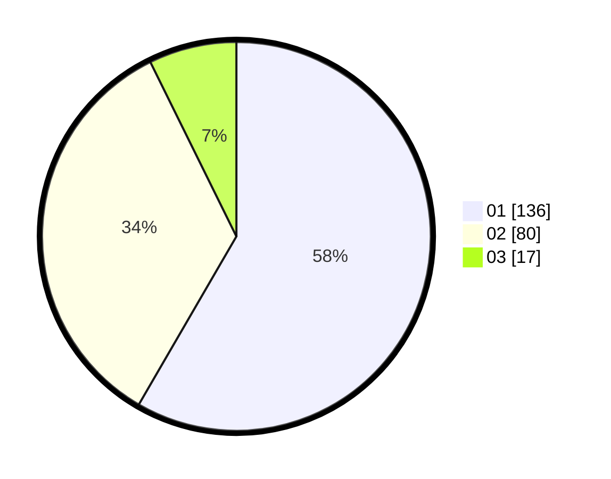

# Hasil

Hasil perolehan suara paslon dapat dilihat pada file paslon-01.txt, paslon-02.txt, dan paslon-03.txt.

Jika tidak ada, artinya data tersebut belum ada pada SIREKAP.

## Perolehan Suara

 * Paslon 01: **136**.
 * Paslon 02: **80**.
 * Paslon 03: **17**.

## Foto C Plano

https://sirekap-obj-formc.kpu.go.id/ce9a/pemilu/ppwp/31/75/06/10/02/3175061002053-20240214-205816--25183ec0-b4e0-4d02-9948-de1f1f47189a.jpg

https://sirekap-obj-formc.kpu.go.id/ce9a/pemilu/ppwp/31/75/06/10/02/3175061002053-20240214-210040--b0a50211-02a2-4a35-9ebc-023c8ae6e80c.jpg

https://sirekap-obj-formc.kpu.go.id/ce9a/pemilu/ppwp/31/75/06/10/02/3175061002053-20240214-185909--461ad0b1-2a59-4bbb-8324-34e40d1c18b7.jpg

## DATA PEMILIH TETAP

Jumlah pemilih dalam DPT: **288**.
 * L: **139**.
 * P: **149**.

## DATA PENGGUNA HAK PILIH

Jumlah pengguna hak pilih dalam DPT: **233**.
 * L: **109**.
 * P: **124**.

Jumlah pengguna hak pilih dalam DPTb: **2**.
 * L: **1**.
 * P: **1**.

Jumlah pengguna hak pilih dalam DPK: **1**.
 * L: **0**.
 * P: **1**.

Jumlah pengguna hak pilih: **236**.
 * L: **110**.
 * P: **126**.

## JUMLAH SUARA SAH DAN TIDAK SAH

JUMLAH SELURUH SUARA SAH: **233**.

JUMLAH SUARA TIDAK SAH: **3**.

JUMLAH SELURUH SUARA SAH DAN SUARA TIDAK SAH: **236**.
