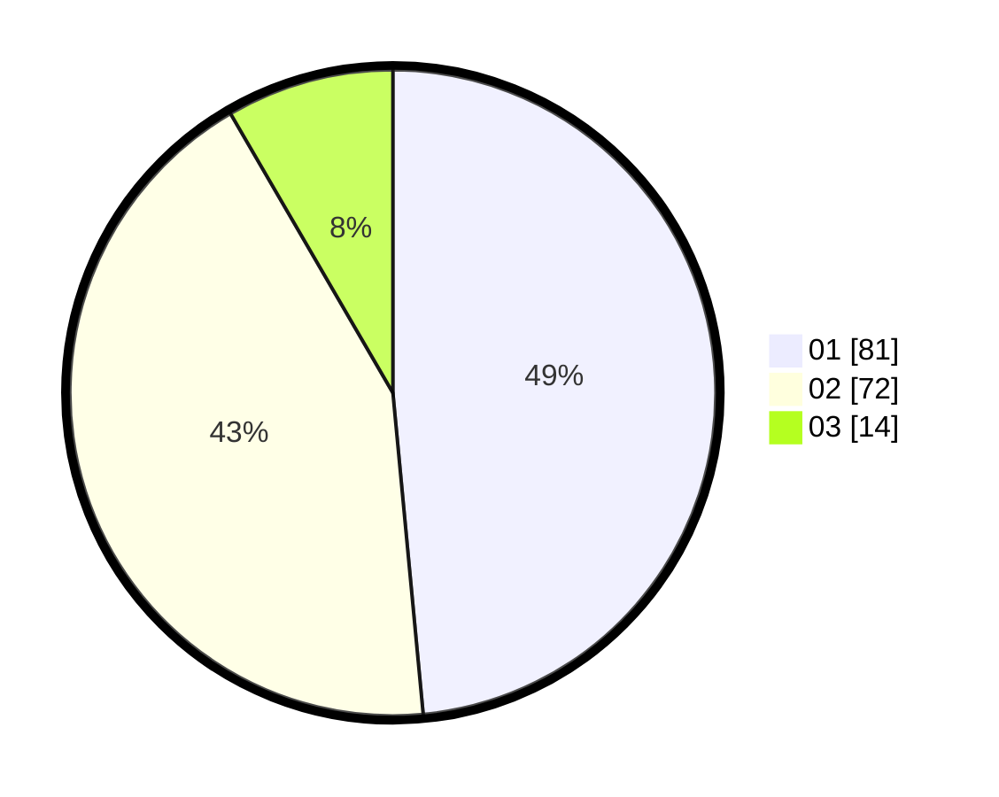

# Hasil

Hasil perolehan suara paslon dapat dilihat pada file paslon-01.txt, paslon-02.txt, dan paslon-03.txt.

Jika tidak ada, artinya data tersebut belum ada pada SIREKAP.

## Perolehan Suara

 * Paslon 01: **81**.
 * Paslon 02: **72**.
 * Paslon 03: **14**.

## Foto C Plano

https://sirekap-obj-formc.kpu.go.id/4e2c/pemilu/ppwp/31/75/06/10/02/3175061002058-20240214-230204--af49a81f-f662-4dc8-86e7-5962823e7f8a.jpg

https://sirekap-obj-formc.kpu.go.id/4e2c/pemilu/ppwp/31/75/06/10/02/3175061002058-20240214-230357--9b39b8f3-2384-45dd-8916-bb75c4d1fd3a.jpg

https://sirekap-obj-formc.kpu.go.id/4e2c/pemilu/ppwp/31/75/06/10/02/3175061002058-20240214-230458--363e804b-d0f0-4eed-b3b1-49f2a65a2c51.jpg

## DATA PEMILIH TETAP

Jumlah pemilih dalam DPT: **225**.
 * L: **112**.
 * P: **113**.

## DATA PENGGUNA HAK PILIH

Jumlah pengguna hak pilih dalam DPT: **166**.
 * L: **82**.
 * P: **84**.

Jumlah pengguna hak pilih dalam DPTb: **1**.
 * L: **1**.
 * P: **0**.

Jumlah pengguna hak pilih dalam DPK: **1**.
 * L: **0**.
 * P: **1**.

Jumlah pengguna hak pilih: **168**.
 * L: **83**.
 * P: **85**.

## JUMLAH SUARA SAH DAN TIDAK SAH

JUMLAH SELURUH SUARA SAH: **167**.

JUMLAH SUARA TIDAK SAH: **1**.

JUMLAH SELURUH SUARA SAH DAN SUARA TIDAK SAH: **168**.
