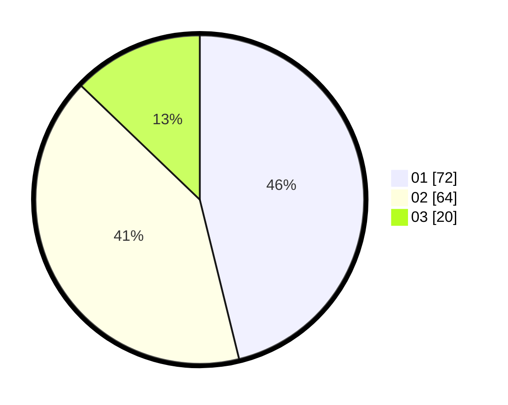

# Hasil

Hasil perolehan suara paslon dapat dilihat pada file paslon-01.txt, paslon-02.txt, dan paslon-03.txt.

Jika tidak ada, artinya data tersebut belum ada pada SIREKAP.

## Perolehan Suara

 * Paslon 01: **72**.
 * Paslon 02: **64**.
 * Paslon 03: **20**.

## Foto C Plano

https://sirekap-obj-formc.kpu.go.id/a29b/pemilu/ppwp/31/75/06/10/02/3175061002059-20240216-043456--926b3968-f48e-4eee-b814-6e7c204ba9eb.jpg

https://sirekap-obj-formc.kpu.go.id/a29b/pemilu/ppwp/31/75/06/10/02/3175061002059-20240216-043500--bb6a3996-7db2-4a9e-8762-896fcc73bacb.jpg

https://sirekap-obj-formc.kpu.go.id/a29b/pemilu/ppwp/31/75/06/10/02/3175061002059-20240216-043457--a8761fa2-2e0b-4132-a1d2-23ffb9395d76.jpg

## DATA PEMILIH TETAP

Jumlah pemilih dalam DPT: **210**.
 * L: **105**.
 * P: **105**.

## DATA PENGGUNA HAK PILIH

Jumlah pengguna hak pilih dalam DPT: **157**.
 * L: **75**.
 * P: **82**.

Jumlah pengguna hak pilih dalam DPTb: **1**.
 * L: **0**.
 * P: **1**.

Jumlah pengguna hak pilih dalam DPK: **0**.
 * L: **0**.
 * P: **0**.

Jumlah pengguna hak pilih: **158**.
 * L: **75**.
 * P: **83**.

## JUMLAH SUARA SAH DAN TIDAK SAH

JUMLAH SELURUH SUARA SAH: **156**.

JUMLAH SUARA TIDAK SAH: **2**.

JUMLAH SELURUH SUARA SAH DAN SUARA TIDAK SAH: **158**.
