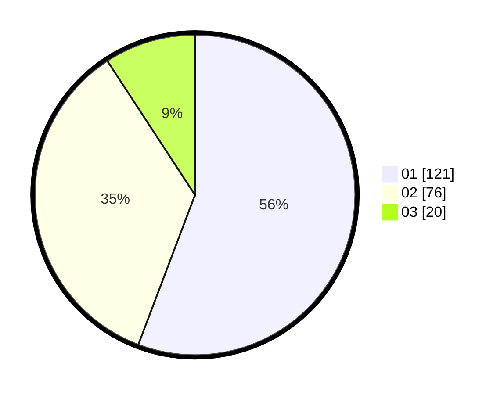

# Hasil

Hasil perolehan suara paslon dapat dilihat pada file paslon-01.txt, paslon-02.txt, dan paslon-03.txt.

Jika tidak ada, artinya data tersebut belum ada pada SIREKAP.

## Perolehan Suara

 * Paslon 01: **121**.
 * Paslon 02: **76**.
 * Paslon 03: **20**.

## Foto C Plano

https://sirekap-obj-formc.kpu.go.id/b6b6/pemilu/ppwp/31/75/06/10/02/3175061002066-20240215-010944--271e9e35-0aba-4e9b-91f5-c1cce48b2acd.jpg

https://sirekap-obj-formc.kpu.go.id/b6b6/pemilu/ppwp/31/75/06/10/02/3175061002066-20240215-011031--bca7afa5-7909-46da-bf12-f5a419b215d0.jpg

https://sirekap-obj-formc.kpu.go.id/b6b6/pemilu/ppwp/31/75/06/10/02/3175061002066-20240215-011113--97f97365-d0e7-410c-b426-2229a9a71e1e.jpg
