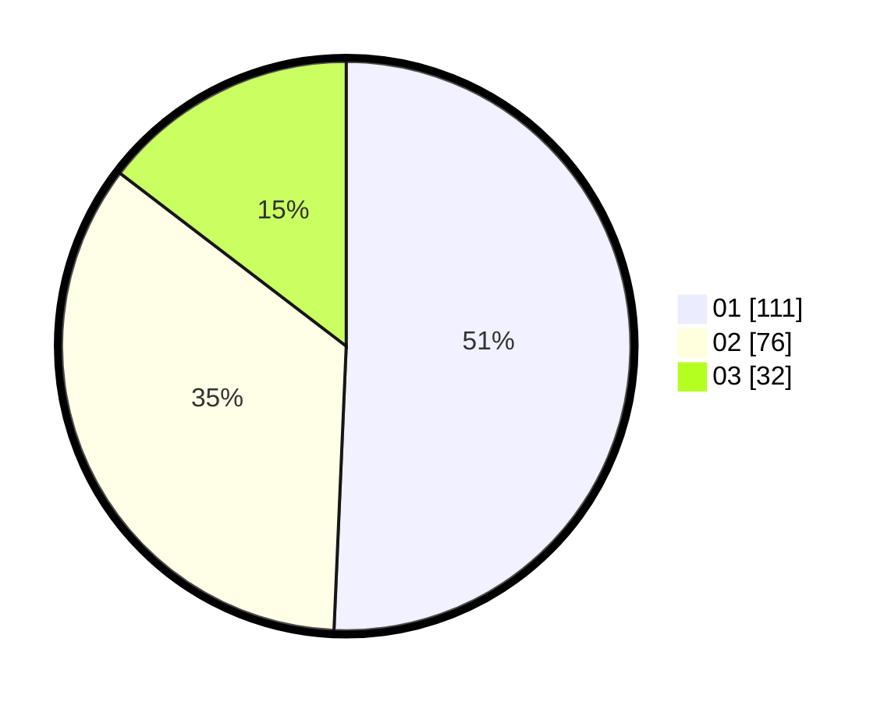

# Hasil

Hasil perolehan suara paslon dapat dilihat pada file paslon-01.txt, paslon-02.txt, dan paslon-03.txt.

Jika tidak ada, artinya data tersebut belum ada pada SIREKAP.

## Perolehan Suara

 * Paslon 01: **111**.
 * Paslon 02: **76**.
 * Paslon 03: **32**.

## Foto C Plano

https://sirekap-obj-formc.kpu.go.id/47fb/pemilu/ppwp/31/75/06/10/02/3175061002070-20240218-115613--3b97d092-9a89-4359-85a9-e96515bceebc.jpg

https://sirekap-obj-formc.kpu.go.id/47fb/pemilu/ppwp/31/75/06/10/02/3175061002070-20240218-115615--8b96a58c-6dfc-4f93-bed2-9c645d585cec.jpg

https://sirekap-obj-formc.kpu.go.id/47fb/pemilu/ppwp/31/75/06/10/02/3175061002070-20240218-115614--df228caf-3840-4dc6-ac95-956aff1ec569.jpg

## DATA PEMILIH TETAP

Jumlah pemilih dalam DPT: **286**.
 * L: **155**.
 * P: **131**.

## DATA PENGGUNA HAK PILIH

Jumlah pengguna hak pilih dalam DPT: **220**.
 * L: **113**.
 * P: **107**.

Jumlah pengguna hak pilih dalam DPTb: **0**.
 * L: **0**.
 * P: **0**.

Jumlah pengguna hak pilih dalam DPK: **0**.
 * L: **0**.
 * P: **0**.

Jumlah pengguna hak pilih: **220**.
 * L: **113**.
 * P: **107**.

## JUMLAH SUARA SAH DAN TIDAK SAH

JUMLAH SELURUH SUARA SAH: **219**.

JUMLAH SUARA TIDAK SAH: **1**.

JUMLAH SELURUH SUARA SAH DAN SUARA TIDAK SAH: **220**.
