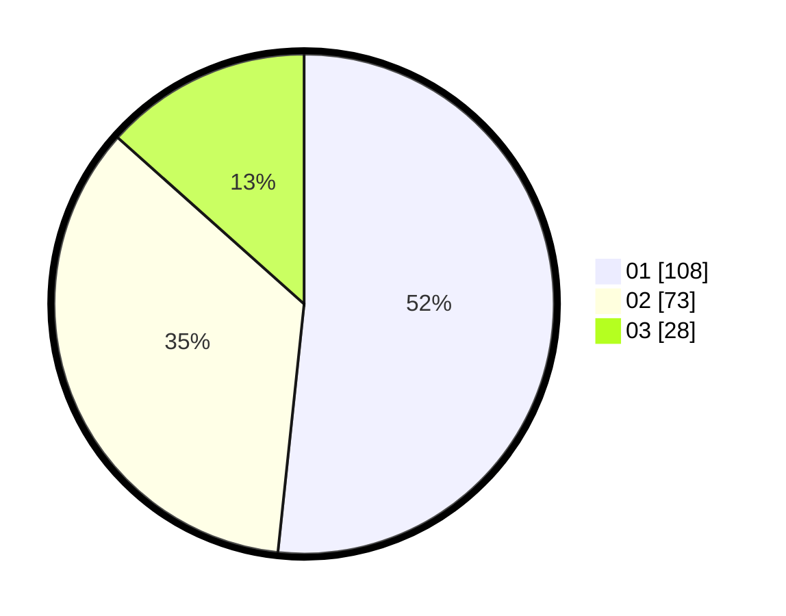

# Hasil

Hasil perolehan suara paslon dapat dilihat pada file paslon-01.txt, paslon-02.txt, dan paslon-03.txt.

Jika tidak ada, artinya data tersebut belum ada pada SIREKAP.

## Perolehan Suara

 * Paslon 01: **108**.
 * Paslon 02: **73**.
 * Paslon 03: **28**.

## Foto C Plano

https://sirekap-obj-formc.kpu.go.id/8be2/pemilu/ppwp/31/75/06/10/02/3175061002072-20240214-190245--f5a0f1ea-af2f-483c-94ae-b1834df0e41f.jpg

https://sirekap-obj-formc.kpu.go.id/8be2/pemilu/ppwp/31/75/06/10/02/3175061002072-20240214-213231--aaaf720a-a367-4e4d-8d4c-93a3bcf299df.jpg

https://sirekap-obj-formc.kpu.go.id/8be2/pemilu/ppwp/31/75/06/10/02/3175061002072-20240214-213337--cbe11e34-1e17-4c71-9745-e4d296e64822.jpg

## DATA PEMILIH TETAP

Jumlah pemilih dalam DPT: **284**.
 * L: **143**.
 * P: **141**.

## DATA PENGGUNA HAK PILIH

Jumlah pengguna hak pilih dalam DPT: **207**.
 * L: **102**.
 * P: **105**.

Jumlah pengguna hak pilih dalam DPTb: **4**.
 * L: **2**.
 * P: **2**.

Jumlah pengguna hak pilih dalam DPK: **0**.
 * L: **0**.
 * P: **0**.

Jumlah pengguna hak pilih: **211**.
 * L: **104**.
 * P: **107**.

## JUMLAH SUARA SAH DAN TIDAK SAH

JUMLAH SELURUH SUARA SAH: **209**.

JUMLAH SUARA TIDAK SAH: **2**.

JUMLAH SELURUH SUARA SAH DAN SUARA TIDAK SAH: **211**.
