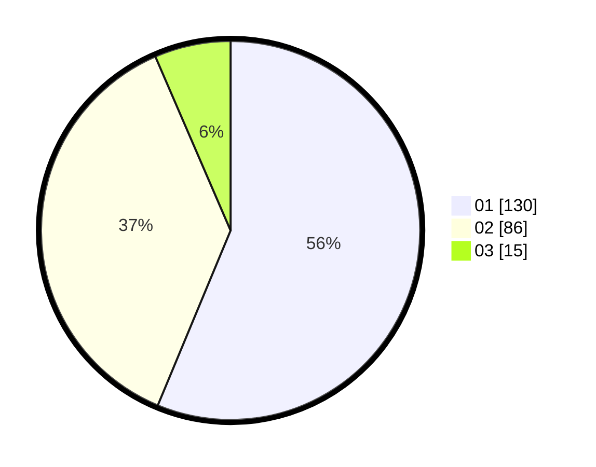

# Hasil

Hasil perolehan suara paslon dapat dilihat pada file paslon-01.txt, paslon-02.txt, dan paslon-03.txt.

Jika tidak ada, artinya data tersebut belum ada pada SIREKAP.

## Perolehan Suara

 * Paslon 01: **130**.
 * Paslon 02: **86**.
 * Paslon 03: **15**.

## Foto C Plano

https://sirekap-obj-formc.kpu.go.id/d5df/pemilu/ppwp/31/75/06/10/02/3175061002074-20240214-232858--f3b030ce-e91b-4a9b-aea0-e1636a08b32c.jpg

https://sirekap-obj-formc.kpu.go.id/d5df/pemilu/ppwp/31/75/06/10/02/3175061002074-20240214-233035--643c0985-d913-453e-b4b2-32749fb33d6a.jpg

https://sirekap-obj-formc.kpu.go.id/d5df/pemilu/ppwp/31/75/06/10/02/3175061002074-20240214-233057--97d9c705-3463-4698-8a49-ee2c5f224b2a.jpg

## DATA PEMILIH TETAP

Jumlah pemilih dalam DPT: **291**.
 * L: **149**.
 * P: **142**.

## DATA PENGGUNA HAK PILIH

Jumlah pengguna hak pilih dalam DPT: **231**.
 * L: **112**.
 * P: **119**.

Jumlah pengguna hak pilih dalam DPTb: **0**.
 * L: **0**.
 * P: **0**.

Jumlah pengguna hak pilih dalam DPK: **3**.
 * L: **0**.
 * P: **3**.

Jumlah pengguna hak pilih: **234**.
 * L: **112**.
 * P: **122**.

## JUMLAH SUARA SAH DAN TIDAK SAH

JUMLAH SELURUH SUARA SAH: **231**.

JUMLAH SUARA TIDAK SAH: **3**.

JUMLAH SELURUH SUARA SAH DAN SUARA TIDAK SAH: **234**.
