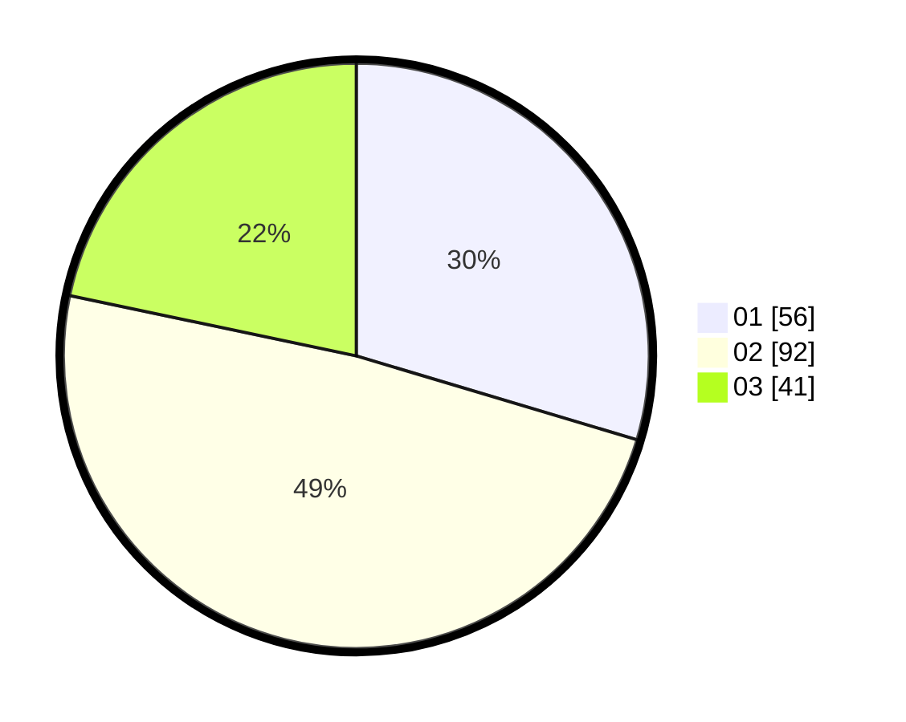

# Hasil

Hasil perolehan suara paslon dapat dilihat pada file paslon-01.txt, paslon-02.txt, dan paslon-03.txt.

Jika tidak ada, artinya data tersebut belum ada pada SIREKAP.

## Perolehan Suara

 * Paslon 01: **56**.
 * Paslon 02: **92**.
 * Paslon 03: **41**.

## Foto C Plano

https://sirekap-obj-formc.kpu.go.id/9338/pemilu/ppwp/31/75/06/10/02/3175061002076-20240215-044331--95001457-9147-42fc-a106-39bfb3e8d094.jpg

https://sirekap-obj-formc.kpu.go.id/9338/pemilu/ppwp/31/75/06/10/02/3175061002076-20240215-035617--668d4d94-8e0c-4b7a-8977-e4017110b551.jpg

https://sirekap-obj-formc.kpu.go.id/9338/pemilu/ppwp/31/75/06/10/02/3175061002076-20240215-035750--b133da18-aa57-4305-94c2-1df508b7a650.jpg
