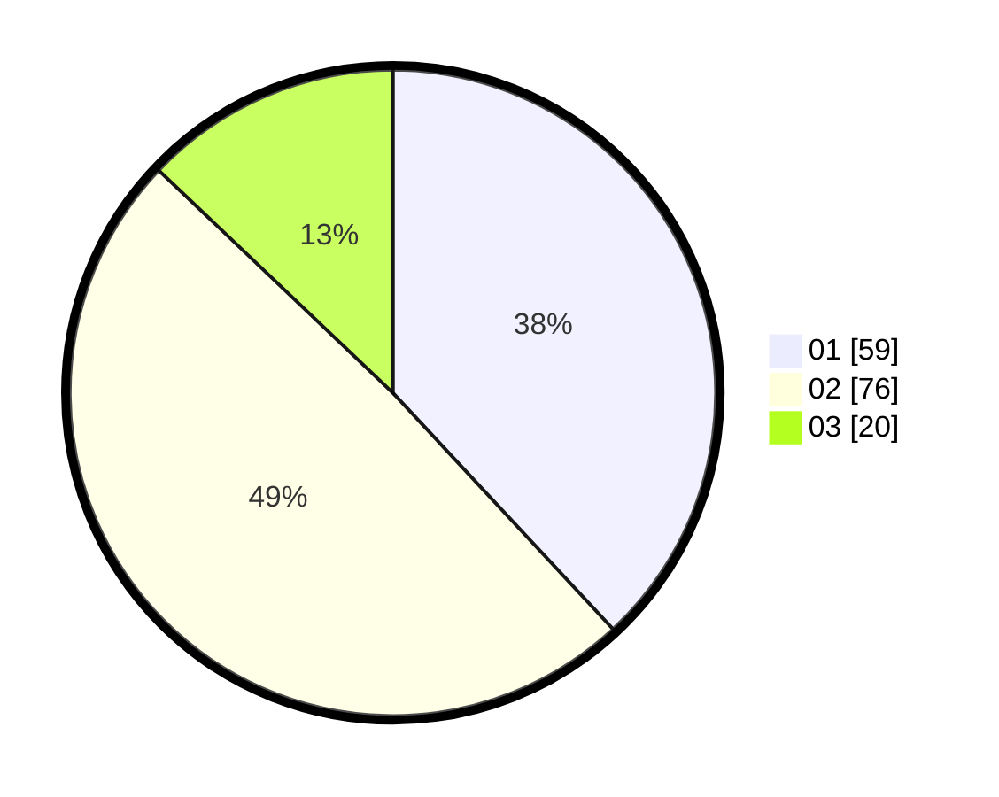

# Hasil

Hasil perolehan suara paslon dapat dilihat pada file paslon-01.txt, paslon-02.txt, dan paslon-03.txt.

Jika tidak ada, artinya data tersebut belum ada pada SIREKAP.

## Perolehan Suara

 * Paslon 01: **59**.
 * Paslon 02: **76**.
 * Paslon 03: **20**.

## Foto C Plano

https://sirekap-obj-formc.kpu.go.id/6423/pemilu/ppwp/31/75/06/10/02/3175061002083-20240215-145139--d0d238b1-0167-4e32-b5ea-1ce712d79e8a.jpg

https://sirekap-obj-formc.kpu.go.id/6423/pemilu/ppwp/31/75/06/10/02/3175061002083-20240215-193845--de3658e5-3c04-4e71-aa79-19126a4821a6.jpg

https://sirekap-obj-formc.kpu.go.id/6423/pemilu/ppwp/31/75/06/10/02/3175061002083-20240215-194318--cd3b8d06-9aa7-4820-af04-b2595c189989.jpg
