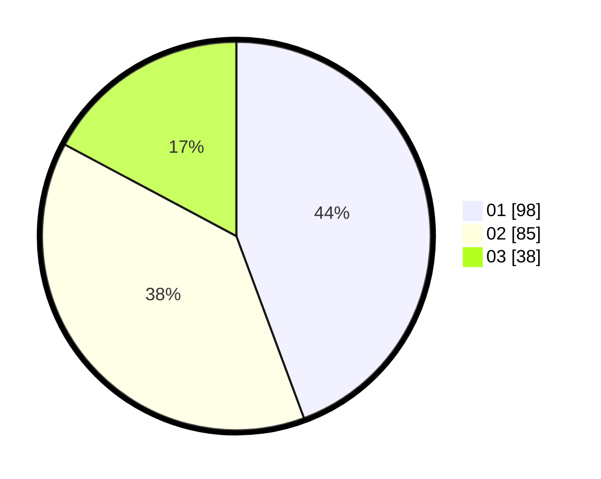

# Hasil

Hasil perolehan suara paslon dapat dilihat pada file paslon-01.txt, paslon-02.txt, dan paslon-03.txt.

Jika tidak ada, artinya data tersebut belum ada pada SIREKAP.

## Perolehan Suara

 * Paslon 01: **98**.
 * Paslon 02: **85**.
 * Paslon 03: **38**.

## Foto C Plano

https://sirekap-obj-formc.kpu.go.id/ab69/pemilu/ppwp/31/75/06/10/03/3175061003009-20240214-205013--a91ae07d-769d-4524-bedf-973f6f84b6af.jpg

https://sirekap-obj-formc.kpu.go.id/ab69/pemilu/ppwp/31/75/06/10/03/3175061003009-20240214-205144--e5257bc9-321c-4c3d-b535-02d11c585d8e.jpg

https://sirekap-obj-formc.kpu.go.id/ab69/pemilu/ppwp/31/75/06/10/03/3175061003009-20240214-205303--5b41cd47-2403-4bf0-9c3f-958a7c7f996d.jpg

## DATA PEMILIH TETAP

Jumlah pemilih dalam DPT: **280**.
 * L: **143**.
 * P: **130**.

## DATA PENGGUNA HAK PILIH

Jumlah pengguna hak pilih dalam DPT: **221**.
 * L: **14**.
 * P: **107**.

Jumlah pengguna hak pilih dalam DPTb: **0**.
 * L: **0**.
 * P: **0**.

Jumlah pengguna hak pilih dalam DPK: **6**.
 * L: **3**.
 * P: **3**.

Jumlah pengguna hak pilih: **227**.
 * L: **0**.
 * P: **0**.

## JUMLAH SUARA SAH DAN TIDAK SAH

JUMLAH SELURUH SUARA SAH: **221**.

JUMLAH SUARA TIDAK SAH: **6**.

JUMLAH SELURUH SUARA SAH DAN SUARA TIDAK SAH: **227**.
