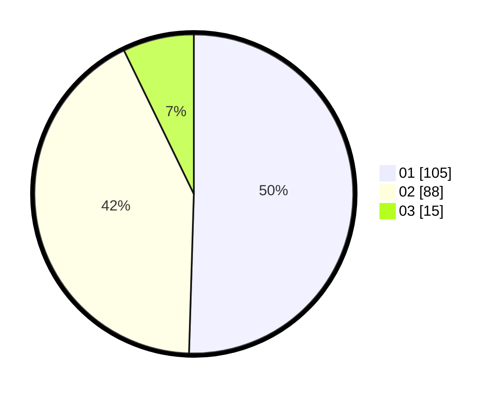

# Hasil

Hasil perolehan suara paslon dapat dilihat pada file paslon-01.txt, paslon-02.txt, dan paslon-03.txt.

Jika tidak ada, artinya data tersebut belum ada pada SIREKAP.

## Perolehan Suara

 * Paslon 01: **105**.
 * Paslon 02: **88**.
 * Paslon 03: **15**.

## Foto C Plano

https://sirekap-obj-formc.kpu.go.id/6e7e/pemilu/ppwp/31/75/06/10/03/3175061003010-20240216-142259--e735ed1f-7a47-4c5a-b656-072d9bc96d1a.jpg

https://sirekap-obj-formc.kpu.go.id/6e7e/pemilu/ppwp/31/75/06/10/03/3175061003010-20240216-142300--eee86764-f259-4070-8fa2-f353b7a73c66.jpg

https://sirekap-obj-formc.kpu.go.id/6e7e/pemilu/ppwp/31/75/06/10/03/3175061003010-20240216-142300--b0f11544-9402-4432-b923-218231b3f80b.jpg

## DATA PEMILIH TETAP

Jumlah pemilih dalam DPT: **277**.
 * L: **141**.
 * P: **136**.

## DATA PENGGUNA HAK PILIH

Jumlah pengguna hak pilih dalam DPT: **209**.
 * L: **103**.
 * P: **106**.

Jumlah pengguna hak pilih dalam DPTb: **0**.
 * L: **0**.
 * P: **0**.

Jumlah pengguna hak pilih dalam DPK: **2**.
 * L: **1**.
 * P: **1**.

Jumlah pengguna hak pilih: **211**.
 * L: **104**.
 * P: **107**.

## JUMLAH SUARA SAH DAN TIDAK SAH

JUMLAH SELURUH SUARA SAH: **208**.

JUMLAH SUARA TIDAK SAH: **3**.

JUMLAH SELURUH SUARA SAH DAN SUARA TIDAK SAH: **211**.
