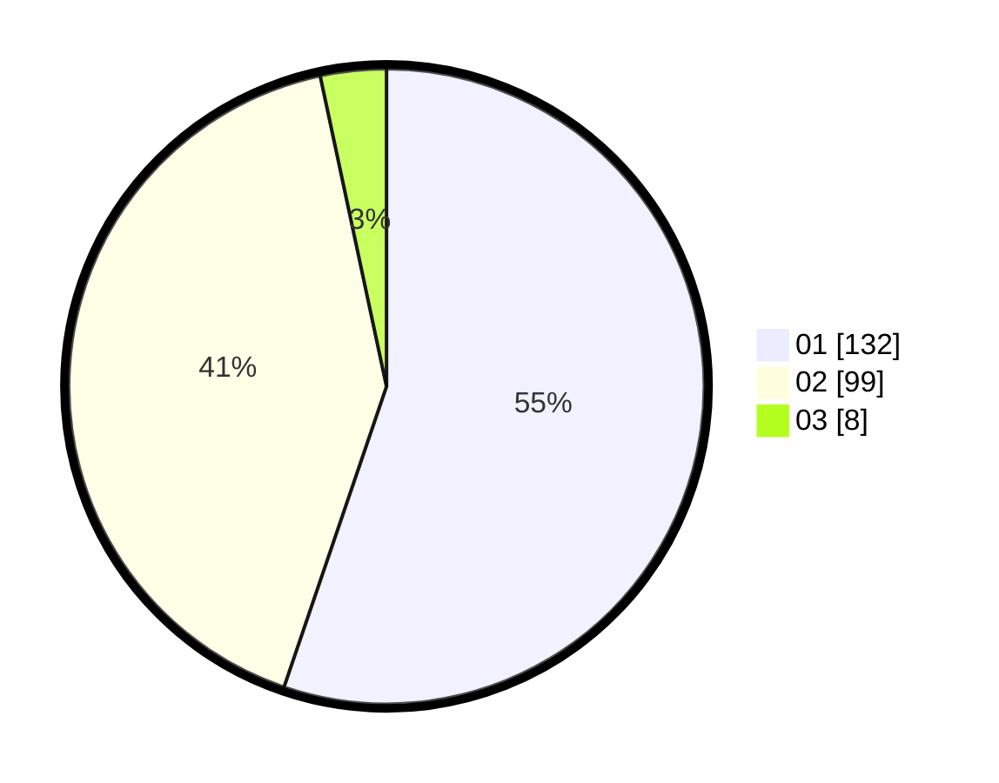

# Hasil

Hasil perolehan suara paslon dapat dilihat pada file paslon-01.txt, paslon-02.txt, dan paslon-03.txt.

Jika tidak ada, artinya data tersebut belum ada pada SIREKAP.

## Perolehan Suara

 * Paslon 01: **132**.
 * Paslon 02: **99**.
 * Paslon 03: **8**.

## Foto C Plano

https://sirekap-obj-formc.kpu.go.id/2cb5/pemilu/ppwp/31/75/06/10/03/3175061003013-20240216-135137--050abe2e-de56-46cf-804e-877c943bac52.jpg

https://sirekap-obj-formc.kpu.go.id/2cb5/pemilu/ppwp/31/75/06/10/03/3175061003013-20240216-135138--c8202afd-b88c-4134-be98-9109d948d51b.jpg

https://sirekap-obj-formc.kpu.go.id/2cb5/pemilu/ppwp/31/75/06/10/03/3175061003013-20240216-135138--6a79e8a0-715c-465c-b50a-28fa3ffc0a42.jpg

## DATA PEMILIH TETAP

Jumlah pemilih dalam DPT: **294**.
 * L: **151**.
 * P: **143**.

## DATA PENGGUNA HAK PILIH

Jumlah pengguna hak pilih dalam DPT: **240**.
 * L: **116**.
 * P: **124**.

Jumlah pengguna hak pilih dalam DPTb: **0**.
 * L: **0**.
 * P: **0**.

Jumlah pengguna hak pilih dalam DPK: **2**.
 * L: **1**.
 * P: **1**.

Jumlah pengguna hak pilih: **242**.
 * L: **117**.
 * P: **125**.

## JUMLAH SUARA SAH DAN TIDAK SAH

JUMLAH SELURUH SUARA SAH: **239**.

JUMLAH SUARA TIDAK SAH: **3**.

JUMLAH SELURUH SUARA SAH DAN SUARA TIDAK SAH: **242**.
