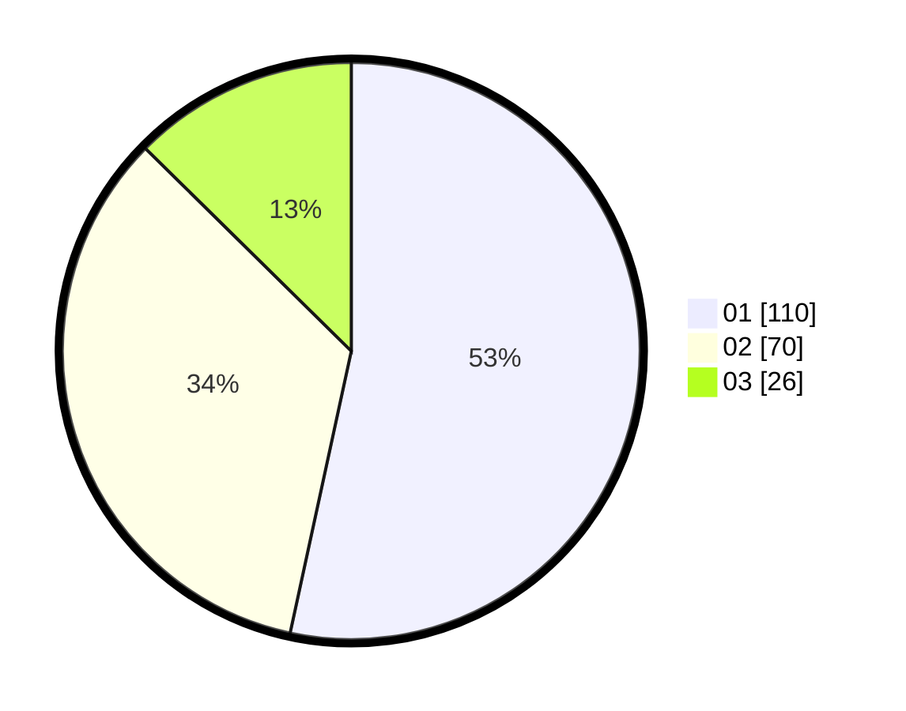

# Hasil

Hasil perolehan suara paslon dapat dilihat pada file paslon-01.txt, paslon-02.txt, dan paslon-03.txt.

Jika tidak ada, artinya data tersebut belum ada pada SIREKAP.

## Perolehan Suara

 * Paslon 01: **110**.
 * Paslon 02: **70**.
 * Paslon 03: **26**.

## Foto C Plano

https://sirekap-obj-formc.kpu.go.id/2dc0/pemilu/ppwp/31/75/06/10/03/3175061003022-20240214-233408--66779d54-f5c7-4d76-8bf0-c34d9dc2f8ad.jpg

https://sirekap-obj-formc.kpu.go.id/2dc0/pemilu/ppwp/31/75/06/10/03/3175061003022-20240214-233351--82bef70d-cb03-4902-aabf-bfc7818583f0.jpg

https://sirekap-obj-formc.kpu.go.id/2dc0/pemilu/ppwp/31/75/06/10/03/3175061003022-20240214-233331--c368ef69-6390-4d23-a29e-e8e1965ad984.jpg
