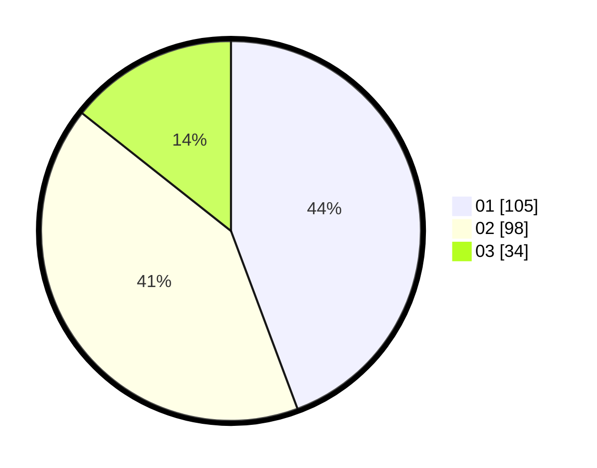

# Hasil

Hasil perolehan suara paslon dapat dilihat pada file paslon-01.txt, paslon-02.txt, dan paslon-03.txt.

Jika tidak ada, artinya data tersebut belum ada pada SIREKAP.

## Perolehan Suara

 * Paslon 01: **105**.
 * Paslon 02: **98**.
 * Paslon 03: **34**.

## Foto C Plano

https://sirekap-obj-formc.kpu.go.id/fbb9/pemilu/ppwp/31/75/06/10/03/3175061003024-20240215-003225--69a5c3b3-2d3f-4025-8c4b-db6599603e8c.jpg

https://sirekap-obj-formc.kpu.go.id/fbb9/pemilu/ppwp/31/75/06/10/03/3175061003024-20240215-003403--c92f74f5-ef6f-400b-8222-4613b5e57bc4.jpg

https://sirekap-obj-formc.kpu.go.id/fbb9/pemilu/ppwp/31/75/06/10/03/3175061003024-20240217-044446--9ca3472a-70a6-4c96-b6f0-329ae257cdeb.jpg

## DATA PEMILIH TETAP

Jumlah pemilih dalam DPT: **220**.
 * L: **106**.
 * P: **114**.

## DATA PENGGUNA HAK PILIH

Jumlah pengguna hak pilih dalam DPT: **220**.
 * L: **106**.
 * P: **114**.

Jumlah pengguna hak pilih dalam DPTb: **13**.
 * L: **6**.
 * P: **7**.

Jumlah pengguna hak pilih dalam DPK: **4**.
 * L: **2**.
 * P: **2**.

Jumlah pengguna hak pilih: **237**.
 * L: **114**.
 * P: **123**.

## JUMLAH SUARA SAH DAN TIDAK SAH

JUMLAH SELURUH SUARA SAH: **237**.

JUMLAH SUARA TIDAK SAH: **0**.

JUMLAH SELURUH SUARA SAH DAN SUARA TIDAK SAH: **237**.
