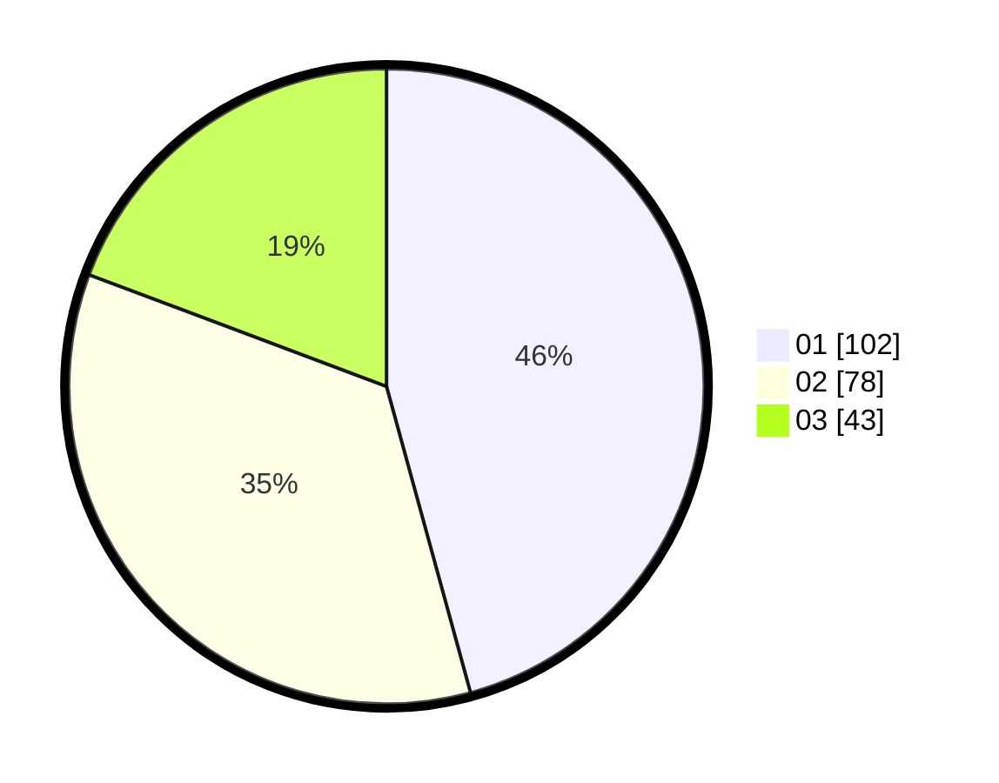

# Hasil

Hasil perolehan suara paslon dapat dilihat pada file paslon-01.txt, paslon-02.txt, dan paslon-03.txt.

Jika tidak ada, artinya data tersebut belum ada pada SIREKAP.

## Perolehan Suara

 * Paslon 01: **102**.
 * Paslon 02: **78**.
 * Paslon 03: **43**.

## Foto C Plano

https://sirekap-obj-formc.kpu.go.id/f779/pemilu/ppwp/31/75/06/10/03/3175061003026-20240214-215047--9eae4ef9-dda7-45a6-89b3-a79293d73d09.jpg

https://sirekap-obj-formc.kpu.go.id/f779/pemilu/ppwp/31/75/06/10/03/3175061003026-20240214-215110--81a0cf74-7987-403d-8ba9-905bf8e4a3fc.jpg

https://sirekap-obj-formc.kpu.go.id/f779/pemilu/ppwp/31/75/06/10/03/3175061003026-20240214-215116--82978ef7-899e-4b33-895c-9bde29f8884c.jpg

## DATA PEMILIH TETAP

Jumlah pemilih dalam DPT: **292**.
 * L: **145**.
 * P: **147**.

## DATA PENGGUNA HAK PILIH

Jumlah pengguna hak pilih dalam DPT: **228**.
 * L: **112**.
 * P: **116**.

Jumlah pengguna hak pilih dalam DPTb: **0**.
 * L: **0**.
 * P: **0**.

Jumlah pengguna hak pilih dalam DPK: **0**.
 * L: **0**.
 * P: **0**.

Jumlah pengguna hak pilih: **228**.
 * L: **112**.
 * P: **116**.

## JUMLAH SUARA SAH DAN TIDAK SAH

JUMLAH SELURUH SUARA SAH: **223**.

JUMLAH SUARA TIDAK SAH: **5**.

JUMLAH SELURUH SUARA SAH DAN SUARA TIDAK SAH: **228**.
