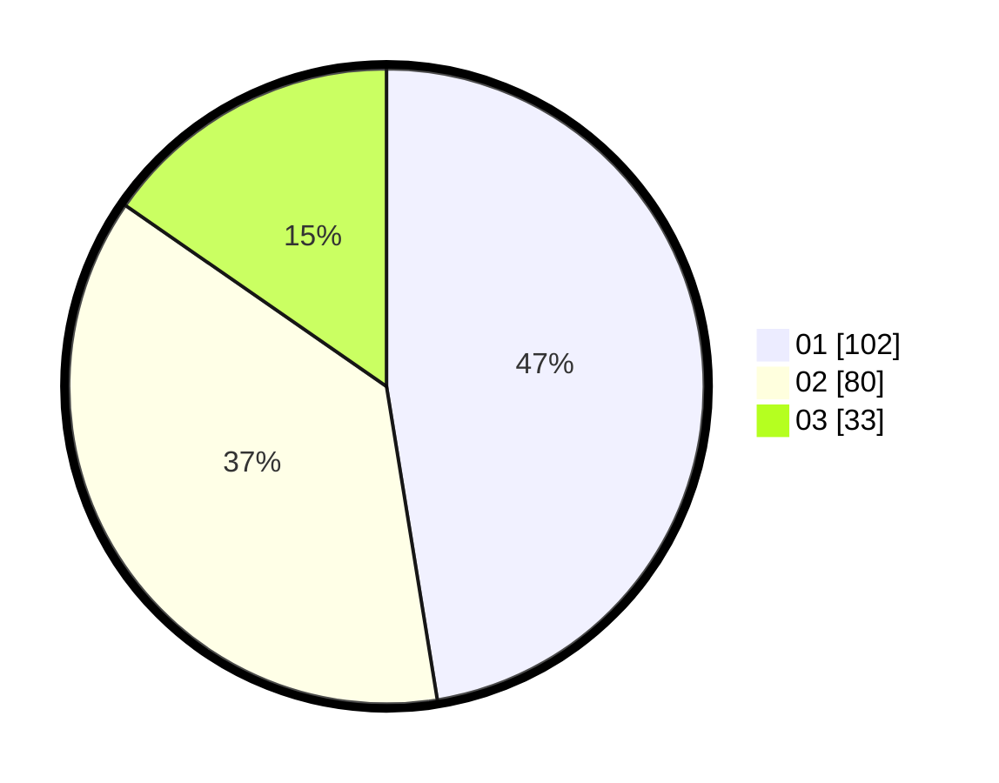

# Hasil

Hasil perolehan suara paslon dapat dilihat pada file paslon-01.txt, paslon-02.txt, dan paslon-03.txt.

Jika tidak ada, artinya data tersebut belum ada pada SIREKAP.

## Perolehan Suara

 * Paslon 01: **102**.
 * Paslon 02: **80**.
 * Paslon 03: **33**.

## Foto C Plano

https://sirekap-obj-formc.kpu.go.id/6de7/pemilu/ppwp/31/75/06/10/03/3175061003031-20240216-034808--c3789974-c7a9-4a76-ba64-fcfab1d06cf4.jpg

https://sirekap-obj-formc.kpu.go.id/6de7/pemilu/ppwp/31/75/06/10/03/3175061003031-20240216-034809--3cd9cd2d-b090-4fbb-9cc1-7ca17b4ff22c.jpg

https://sirekap-obj-formc.kpu.go.id/6de7/pemilu/ppwp/31/75/06/10/03/3175061003031-20240216-034809--d541cf67-410a-4e9f-8a2e-3e8e1df81f09.jpg

## DATA PEMILIH TETAP

Jumlah pemilih dalam DPT: **287**.
 * L: **145**.
 * P: **142**.

## DATA PENGGUNA HAK PILIH

Jumlah pengguna hak pilih dalam DPT: **214**.
 * L: **103**.
 * P: **111**.

Jumlah pengguna hak pilih dalam DPTb: **2**.
 * L: **1**.
 * P: **1**.

Jumlah pengguna hak pilih dalam DPK: **3**.
 * L: **1**.
 * P: **2**.

Jumlah pengguna hak pilih: **219**.
 * L: **105**.
 * P: **114**.

## JUMLAH SUARA SAH DAN TIDAK SAH

JUMLAH SELURUH SUARA SAH: **215**.

JUMLAH SUARA TIDAK SAH: **4**.

JUMLAH SELURUH SUARA SAH DAN SUARA TIDAK SAH: **219**.
