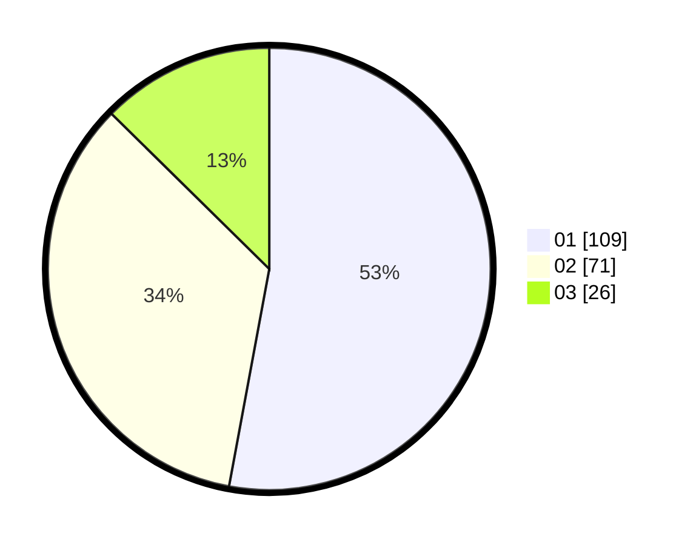

# Hasil

Hasil perolehan suara paslon dapat dilihat pada file paslon-01.txt, paslon-02.txt, dan paslon-03.txt.

Jika tidak ada, artinya data tersebut belum ada pada SIREKAP.

## Perolehan Suara

 * Paslon 01: **109**.
 * Paslon 02: **71**.
 * Paslon 03: **26**.

## Foto C Plano

https://sirekap-obj-formc.kpu.go.id/c858/pemilu/ppwp/31/75/06/10/03/3175061003033-20240215-020328--4056bc54-a10b-47c3-bd21-9c8cc6008a37.jpg

https://sirekap-obj-formc.kpu.go.id/c858/pemilu/ppwp/31/75/06/10/03/3175061003033-20240214-211136--cc8f94cf-535b-4f85-9e13-cf12faf94559.jpg

https://sirekap-obj-formc.kpu.go.id/c858/pemilu/ppwp/31/75/06/10/03/3175061003033-20240214-211246--1fd310ee-de76-4a61-b2cd-e6ed251df9b9.jpg
