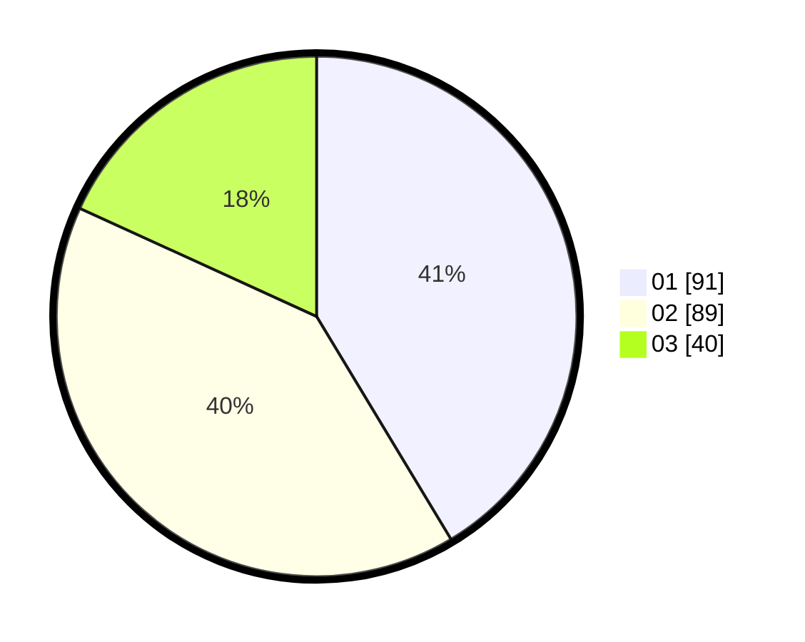

# Hasil

Hasil perolehan suara paslon dapat dilihat pada file paslon-01.txt, paslon-02.txt, dan paslon-03.txt.

Jika tidak ada, artinya data tersebut belum ada pada SIREKAP.

## Perolehan Suara

 * Paslon 01: **91**.
 * Paslon 02: **89**.
 * Paslon 03: **40**.

## Foto C Plano

https://sirekap-obj-formc.kpu.go.id/79e9/pemilu/ppwp/31/75/06/10/03/3175061003038-20240214-191212--cac15687-024c-4506-8b45-2579bcffdbea.jpg

https://sirekap-obj-formc.kpu.go.id/79e9/pemilu/ppwp/31/75/06/10/03/3175061003038-20240216-114528--bed702d9-4f1d-4cfb-8c8f-b324fb5589a7.jpg

https://sirekap-obj-formc.kpu.go.id/79e9/pemilu/ppwp/31/75/06/10/03/3175061003038-20240214-190341--a24f64d1-3854-411e-af38-785c6e136ae2.jpg

## DATA PEMILIH TETAP

Jumlah pemilih dalam DPT: **273**.
 * L: **134**.
 * P: **139**.

## DATA PENGGUNA HAK PILIH

Jumlah pengguna hak pilih dalam DPT: **220**.
 * L: **102**.
 * P: **118**.

Jumlah pengguna hak pilih dalam DPTb: **0**.
 * L: **0**.
 * P: **0**.

Jumlah pengguna hak pilih dalam DPK: **1**.
 * L: **0**.
 * P: **1**.

Jumlah pengguna hak pilih: **221**.
 * L: **102**.
 * P: **119**.

## JUMLAH SUARA SAH DAN TIDAK SAH

JUMLAH SELURUH SUARA SAH: **220**.

JUMLAH SUARA TIDAK SAH: **1**.

JUMLAH SELURUH SUARA SAH DAN SUARA TIDAK SAH: **221**.
