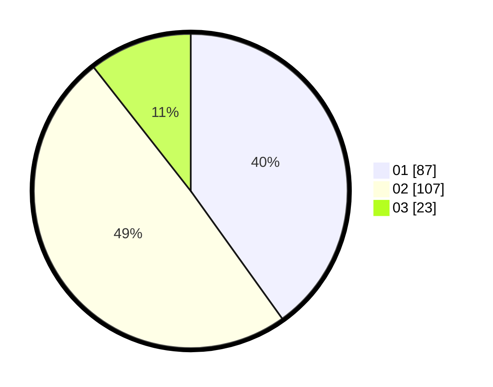

# Hasil

Hasil perolehan suara paslon dapat dilihat pada file paslon-01.txt, paslon-02.txt, dan paslon-03.txt.

Jika tidak ada, artinya data tersebut belum ada pada SIREKAP.

## Perolehan Suara

 * Paslon 01: **87**.
 * Paslon 02: **107**.
 * Paslon 03: **23**.

## Foto C Plano

https://sirekap-obj-formc.kpu.go.id/d50a/pemilu/ppwp/31/75/06/10/03/3175061003046-20240214-160057--cbcf7f89-1015-4236-aec9-8102d915d489.jpg

https://sirekap-obj-formc.kpu.go.id/d50a/pemilu/ppwp/31/75/06/10/03/3175061003046-20240214-223546--cd368a2d-a041-405d-b539-06a9e11c7029.jpg

https://sirekap-obj-formc.kpu.go.id/d50a/pemilu/ppwp/31/75/06/10/03/3175061003046-20240215-110351--b3d2dbf2-b3a2-4af9-b8d9-54c58bc46330.jpg

## DATA PEMILIH TETAP

Jumlah pemilih dalam DPT: **277**.
 * L: **138**.
 * P: **139**.

## DATA PENGGUNA HAK PILIH

Jumlah pengguna hak pilih dalam DPT: **218**.
 * L: **105**.
 * P: **113**.

Jumlah pengguna hak pilih dalam DPTb: **0**.
 * L: **0**.
 * P: **0**.

Jumlah pengguna hak pilih dalam DPK: **1**.
 * L: **1**.
 * P: **0**.

Jumlah pengguna hak pilih: **219**.
 * L: **106**.
 * P: **113**.

## JUMLAH SUARA SAH DAN TIDAK SAH

JUMLAH SELURUH SUARA SAH: **217**.

JUMLAH SUARA TIDAK SAH: **2**.

JUMLAH SELURUH SUARA SAH DAN SUARA TIDAK SAH: **219**.
