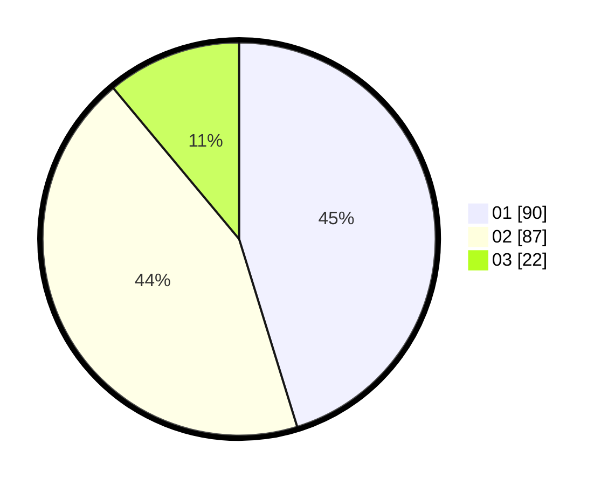

# Hasil

Hasil perolehan suara paslon dapat dilihat pada file paslon-01.txt, paslon-02.txt, dan paslon-03.txt.

Jika tidak ada, artinya data tersebut belum ada pada SIREKAP.

## Perolehan Suara

 * Paslon 01: **90**.
 * Paslon 02: **87**.
 * Paslon 03: **22**.

## Foto C Plano

https://sirekap-obj-formc.kpu.go.id/58d3/pemilu/ppwp/31/75/06/10/03/3175061003049-20240214-185657--abe6e858-ca0b-4e5b-b9ec-7d0dc3ac918d.jpg

https://sirekap-obj-formc.kpu.go.id/58d3/pemilu/ppwp/31/75/06/10/03/3175061003049-20240215-212816--f85da533-43d8-4426-b45e-32dec7187f5c.jpg

https://sirekap-obj-formc.kpu.go.id/58d3/pemilu/ppwp/31/75/06/10/03/3175061003049-20240214-185458--a2bcf4df-9116-40df-903f-0985fe9ef9eb.jpg

## DATA PEMILIH TETAP

Jumlah pemilih dalam DPT: **788**.
 * L: **0**.
 * P: **7**.

## DATA PENGGUNA HAK PILIH

Jumlah pengguna hak pilih dalam DPT: **190**.
 * L: **0**.
 * P: **788**.

Jumlah pengguna hak pilih dalam DPTb: **1**.
 * L: **1**.
 * P: **28**.

Jumlah pengguna hak pilih dalam DPK: **8**.
 * L: **0**.
 * P: **8**.

Jumlah pengguna hak pilih: **200**.
 * L: **92**.
 * P: **198**.

## JUMLAH SUARA SAH DAN TIDAK SAH

JUMLAH SELURUH SUARA SAH: **199**.

JUMLAH SUARA TIDAK SAH: **1**.

JUMLAH SELURUH SUARA SAH DAN SUARA TIDAK SAH: **200**.
