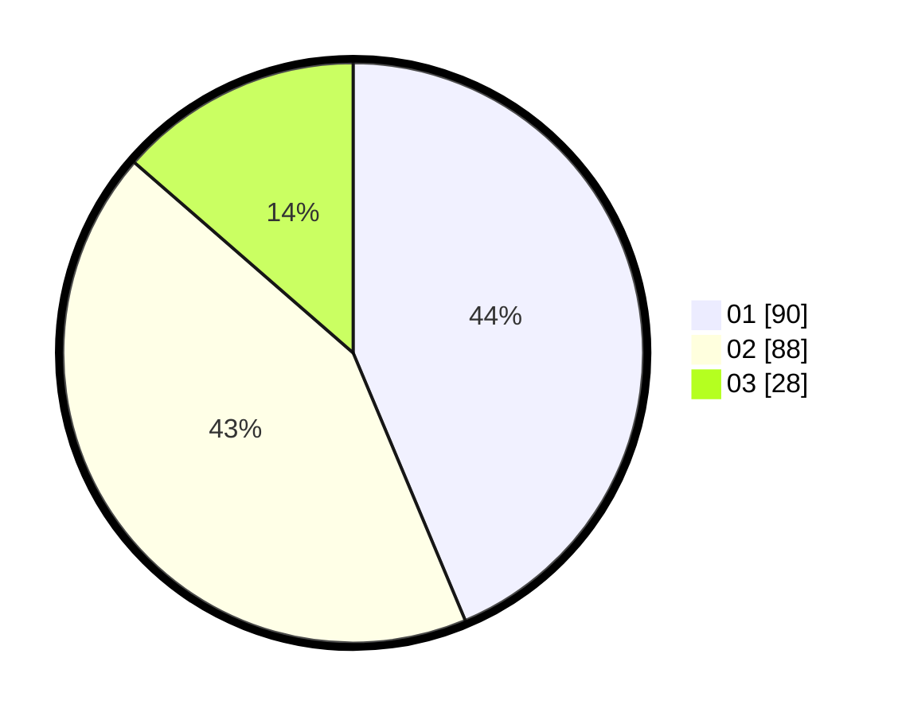

# Hasil

Hasil perolehan suara paslon dapat dilihat pada file paslon-01.txt, paslon-02.txt, dan paslon-03.txt.

Jika tidak ada, artinya data tersebut belum ada pada SIREKAP.

## Perolehan Suara

 * Paslon 01: **90**.
 * Paslon 02: **88**.
 * Paslon 03: **28**.

## Foto C Plano

https://sirekap-obj-formc.kpu.go.id/94eb/pemilu/ppwp/31/75/06/10/03/3175061003050-20240215-005937--4e46e270-e660-4a4e-90d1-9262ffb7a8d0.jpg

https://sirekap-obj-formc.kpu.go.id/94eb/pemilu/ppwp/31/75/06/10/03/3175061003050-20240215-005746--ee04650a-3861-4e77-b205-78936db66813.jpg

https://sirekap-obj-formc.kpu.go.id/94eb/pemilu/ppwp/31/75/06/10/03/3175061003050-20240215-005641--2f3e4da0-e585-4ed2-8e81-575ec0acb84d.jpg
