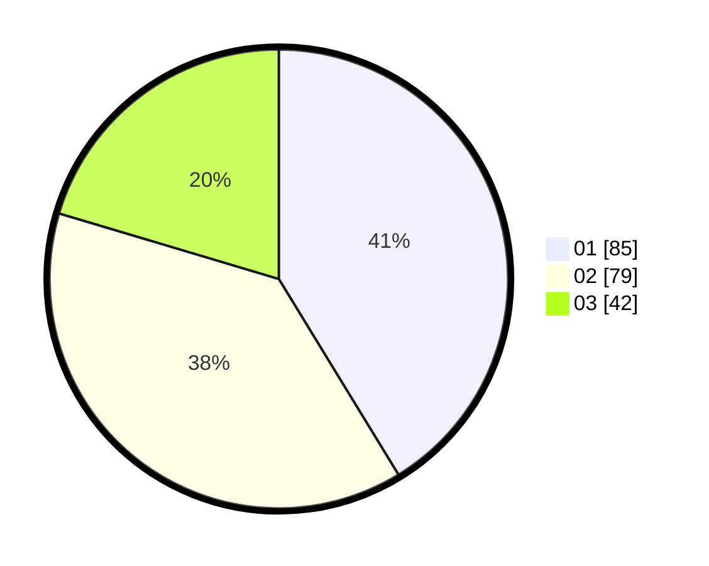

# Hasil

Hasil perolehan suara paslon dapat dilihat pada file paslon-01.txt, paslon-02.txt, dan paslon-03.txt.

Jika tidak ada, artinya data tersebut belum ada pada SIREKAP.

## Perolehan Suara

 * Paslon 01: **85**.
 * Paslon 02: **79**.
 * Paslon 03: **42**.

## Foto C Plano

https://sirekap-obj-formc.kpu.go.id/c957/pemilu/ppwp/31/75/06/10/03/3175061003055-20240214-203239--b7c1cfad-aafd-44eb-9884-d7179fcf4639.jpg

https://sirekap-obj-formc.kpu.go.id/c957/pemilu/ppwp/31/75/06/10/03/3175061003055-20240214-203255--581a389e-17eb-4d87-95e3-fee6c860e9dd.jpg

https://sirekap-obj-formc.kpu.go.id/c957/pemilu/ppwp/31/75/06/10/03/3175061003055-20240214-191643--c731eee8-bc2a-49e6-afe9-974edcabb110.jpg
