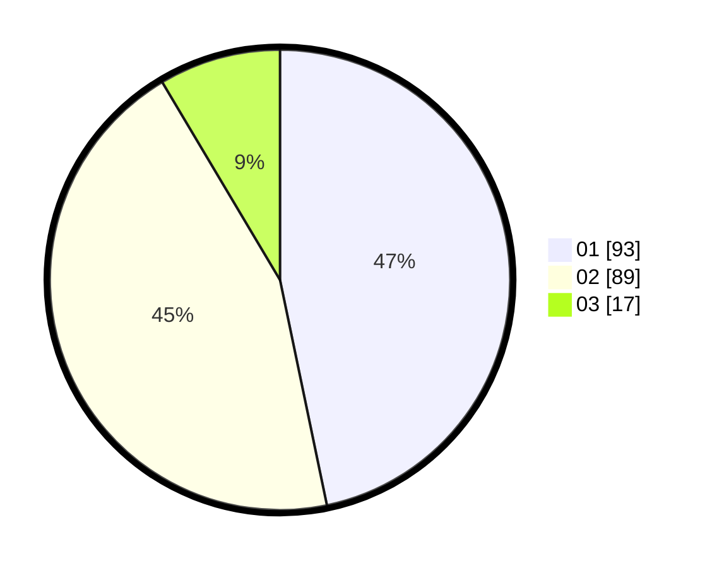

# Hasil

Hasil perolehan suara paslon dapat dilihat pada file paslon-01.txt, paslon-02.txt, dan paslon-03.txt.

Jika tidak ada, artinya data tersebut belum ada pada SIREKAP.

## Perolehan Suara

 * Paslon 01: **93**.
 * Paslon 02: **89**.
 * Paslon 03: **17**.

## Foto C Plano

https://sirekap-obj-formc.kpu.go.id/38f1/pemilu/ppwp/31/75/06/10/03/3175061003059-20240214-231027--9aaa1136-5ba0-4b16-aedd-63b0ffc28284.jpg

https://sirekap-obj-formc.kpu.go.id/38f1/pemilu/ppwp/31/75/06/10/03/3175061003059-20240214-211824--a6db31fb-250d-49e5-ae6d-bc9f5bf6cf66.jpg

https://sirekap-obj-formc.kpu.go.id/38f1/pemilu/ppwp/31/75/06/10/03/3175061003059-20240214-211945--15b8f3b0-5292-4982-b977-d4b6ca75f9d2.jpg

## DATA PEMILIH TETAP

Jumlah pemilih dalam DPT: **288**.
 * L: **151**.
 * P: **137**.

## DATA PENGGUNA HAK PILIH

Jumlah pengguna hak pilih dalam DPT: **202**.
 * L: **97**.
 * P: **105**.

Jumlah pengguna hak pilih dalam DPTb: **1**.
 * L: **1**.
 * P: **0**.

Jumlah pengguna hak pilih dalam DPK: **1**.
 * L: **0**.
 * P: **1**.

Jumlah pengguna hak pilih: **204**.
 * L: **98**.
 * P: **106**.

## JUMLAH SUARA SAH DAN TIDAK SAH

JUMLAH SELURUH SUARA SAH: **199**.

JUMLAH SUARA TIDAK SAH: **5**.

JUMLAH SELURUH SUARA SAH DAN SUARA TIDAK SAH: **204**.
