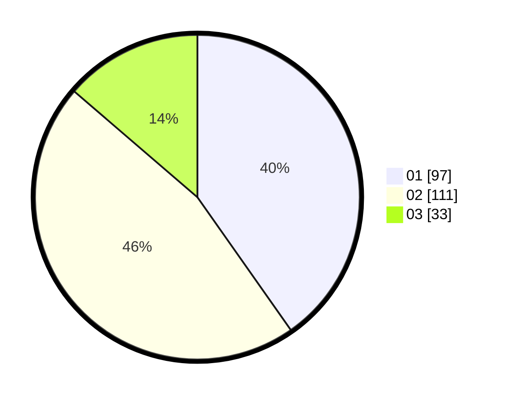

# Hasil

Hasil perolehan suara paslon dapat dilihat pada file paslon-01.txt, paslon-02.txt, dan paslon-03.txt.

Jika tidak ada, artinya data tersebut belum ada pada SIREKAP.

## Perolehan Suara

 * Paslon 01: **97**.
 * Paslon 02: **111**.
 * Paslon 03: **33**.

## Foto C Plano

https://sirekap-obj-formc.kpu.go.id/79a0/pemilu/ppwp/31/75/06/10/03/3175061003061-20240214-211358--d6310b26-6b0f-4c4a-95c7-d828d84e4cee.jpg

https://sirekap-obj-formc.kpu.go.id/79a0/pemilu/ppwp/31/75/06/10/03/3175061003061-20240214-211425--bda7a017-c76b-432c-9a30-d11d75319914.jpg

https://sirekap-obj-formc.kpu.go.id/79a0/pemilu/ppwp/31/75/06/10/03/3175061003061-20240214-211507--14d17261-243e-4cea-95db-b34959308ce9.jpg

## DATA PEMILIH TETAP

Jumlah pemilih dalam DPT: **285**.
 * L: **142**.
 * P: **143**.

## DATA PENGGUNA HAK PILIH

Jumlah pengguna hak pilih dalam DPT: **238**.
 * L: **114**.
 * P: **124**.

Jumlah pengguna hak pilih dalam DPTb: **802**.
 * L: **0**.
 * P: **2**.

Jumlah pengguna hak pilih dalam DPK: **3**.
 * L: **0**.
 * P: **3**.

Jumlah pengguna hak pilih: **243**.
 * L: **114**.
 * P: **129**.

## JUMLAH SUARA SAH DAN TIDAK SAH

JUMLAH SELURUH SUARA SAH: **241**.

JUMLAH SUARA TIDAK SAH: **2**.

JUMLAH SELURUH SUARA SAH DAN SUARA TIDAK SAH: **243**.
