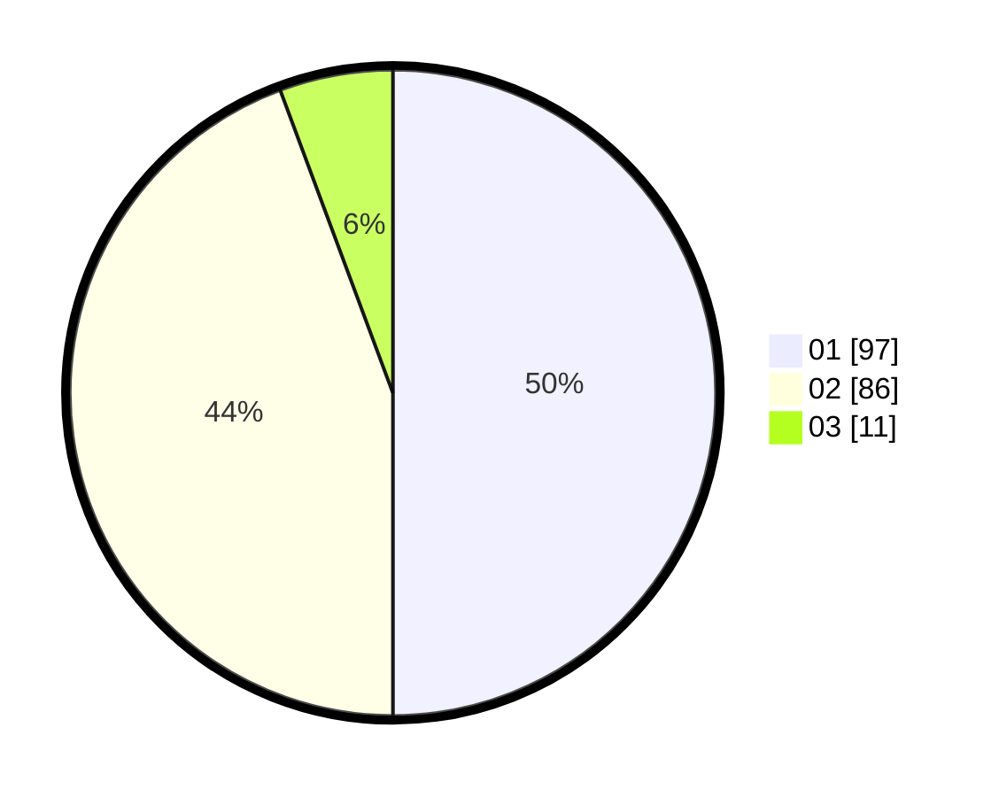

# Hasil

Hasil perolehan suara paslon dapat dilihat pada file paslon-01.txt, paslon-02.txt, dan paslon-03.txt.

Jika tidak ada, artinya data tersebut belum ada pada SIREKAP.

## Perolehan Suara

 * Paslon 01: **97**.
 * Paslon 02: **86**.
 * Paslon 03: **11**.

## Foto C Plano

https://sirekap-obj-formc.kpu.go.id/7a7a/pemilu/ppwp/31/75/06/10/03/3175061003070-20240214-201035--261d9f4f-991d-4e66-910b-526b9bff6fb5.jpg

https://sirekap-obj-formc.kpu.go.id/7a7a/pemilu/ppwp/31/75/06/10/03/3175061003070-20240214-201037--1dca8cce-57d6-4585-94e1-7ed61add78d8.jpg

https://sirekap-obj-formc.kpu.go.id/7a7a/pemilu/ppwp/31/75/06/10/03/3175061003070-20240214-201227--8d9b725a-f253-4072-aa83-794d83275519.jpg

## DATA PEMILIH TETAP

Jumlah pemilih dalam DPT: **242**.
 * L: **127**.
 * P: **115**.

## DATA PENGGUNA HAK PILIH

Jumlah pengguna hak pilih dalam DPT: **192**.
 * L: **99**.
 * P: **93**.

Jumlah pengguna hak pilih dalam DPTb: **3**.
 * L: **1**.
 * P: **2**.

Jumlah pengguna hak pilih dalam DPK: **0**.
 * L: **0**.
 * P: **0**.

Jumlah pengguna hak pilih: **195**.
 * L: **100**.
 * P: **95**.

## JUMLAH SUARA SAH DAN TIDAK SAH

JUMLAH SELURUH SUARA SAH: **194**.

JUMLAH SUARA TIDAK SAH: **1**.

JUMLAH SELURUH SUARA SAH DAN SUARA TIDAK SAH: **195**.
