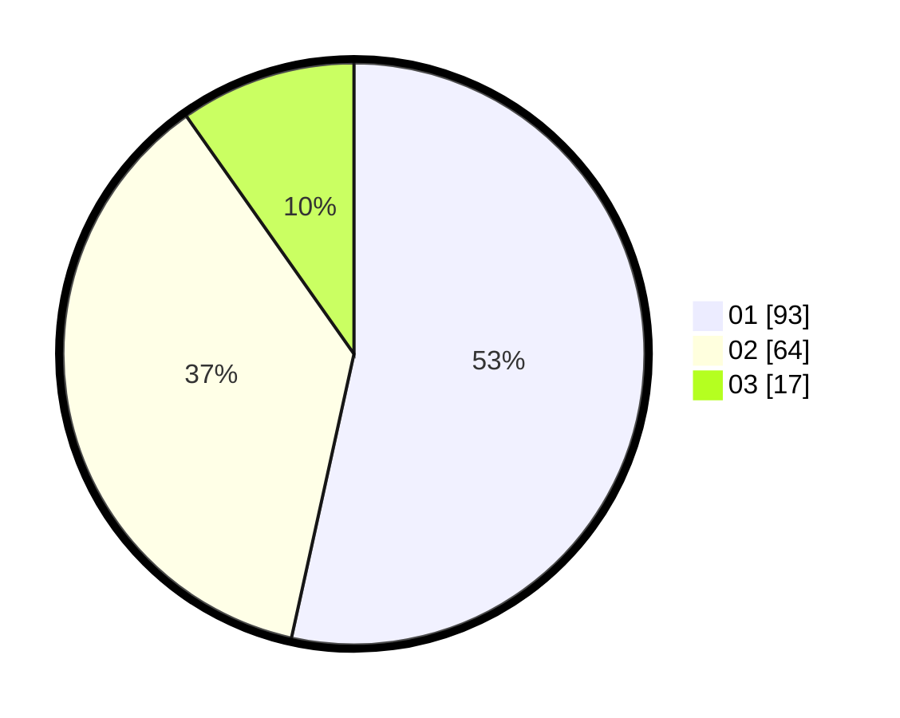

# Hasil

Hasil perolehan suara paslon dapat dilihat pada file paslon-01.txt, paslon-02.txt, dan paslon-03.txt.

Jika tidak ada, artinya data tersebut belum ada pada SIREKAP.

## Perolehan Suara

 * Paslon 01: **93**.
 * Paslon 02: **64**.
 * Paslon 03: **17**.

## Foto C Plano

https://sirekap-obj-formc.kpu.go.id/73a2/pemilu/ppwp/31/75/06/10/03/3175061003081-20240214-191908--a768f952-341d-4254-9865-fe8d4d7225b2.jpg

https://sirekap-obj-formc.kpu.go.id/73a2/pemilu/ppwp/31/75/06/10/03/3175061003081-20240214-190408--77028735-849f-463b-95ca-f92048cebee0.jpg

https://sirekap-obj-formc.kpu.go.id/73a2/pemilu/ppwp/31/75/06/10/03/3175061003081-20240214-191101--fef08a63-45da-440e-9827-04756cf633de.jpg
