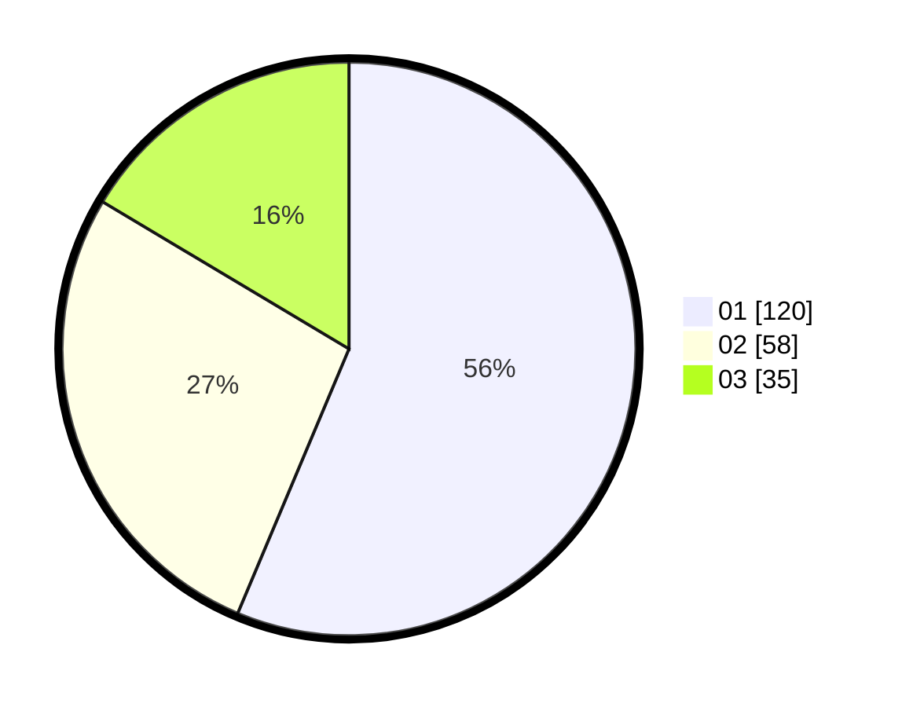

# Hasil

Hasil perolehan suara paslon dapat dilihat pada file paslon-01.txt, paslon-02.txt, dan paslon-03.txt.

Jika tidak ada, artinya data tersebut belum ada pada SIREKAP.

## Perolehan Suara

 * Paslon 01: **120**.
 * Paslon 02: **58**.
 * Paslon 03: **35**.

## Foto C Plano

https://sirekap-obj-formc.kpu.go.id/1763/pemilu/ppwp/31/75/06/10/03/3175061003082-20240216-024301--b0d52e37-0209-4408-988b-be8ee8b8891c.jpg

https://sirekap-obj-formc.kpu.go.id/1763/pemilu/ppwp/31/75/06/10/03/3175061003082-20240216-025753--23386560-9e39-43b2-aa61-256e7f2250fb.jpg

https://sirekap-obj-formc.kpu.go.id/1763/pemilu/ppwp/31/75/06/10/03/3175061003082-20240216-024306--264a71dc-add5-4b50-a693-82802dce2645.jpg

## DATA PEMILIH TETAP

Jumlah pemilih dalam DPT: **280**.
 * L: **134**.
 * P: **146**.

## DATA PENGGUNA HAK PILIH

Jumlah pengguna hak pilih dalam DPT: **214**.
 * L: **103**.
 * P: **111**.

Jumlah pengguna hak pilih dalam DPTb: **0**.
 * L: **0**.
 * P: **0**.

Jumlah pengguna hak pilih dalam DPK: **0**.
 * L: **0**.
 * P: **0**.

Jumlah pengguna hak pilih: **214**.
 * L: **103**.
 * P: **111**.

## JUMLAH SUARA SAH DAN TIDAK SAH

JUMLAH SELURUH SUARA SAH: **213**.

JUMLAH SUARA TIDAK SAH: **1**.

JUMLAH SELURUH SUARA SAH DAN SUARA TIDAK SAH: **214**.
