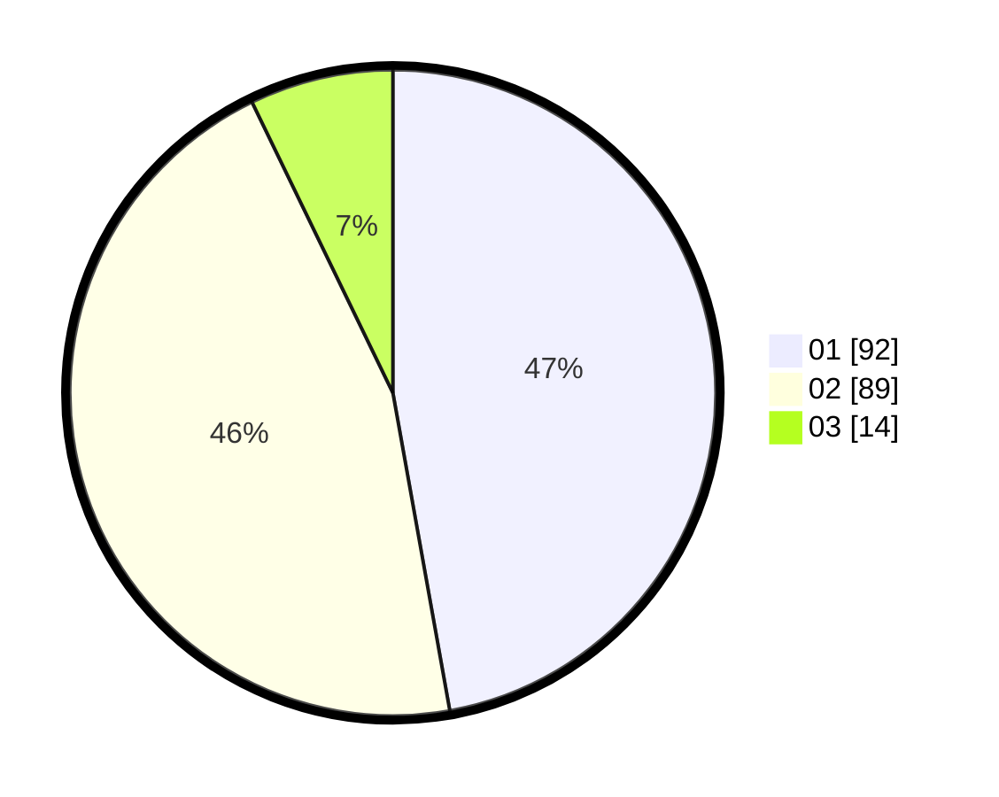

# Hasil

Hasil perolehan suara paslon dapat dilihat pada file paslon-01.txt, paslon-02.txt, dan paslon-03.txt.

Jika tidak ada, artinya data tersebut belum ada pada SIREKAP.

## Perolehan Suara

 * Paslon 01: **92**.
 * Paslon 02: **89**.
 * Paslon 03: **14**.

## Foto C Plano

https://sirekap-obj-formc.kpu.go.id/efd1/pemilu/ppwp/31/75/06/10/03/3175061003084-20240214-205237--ab2d0d57-164a-42ec-a1f4-b02adee64e80.jpg

https://sirekap-obj-formc.kpu.go.id/efd1/pemilu/ppwp/31/75/06/10/03/3175061003084-20240214-205208--67ab89f8-8c8a-4219-92de-1c34bc99426f.jpg

https://sirekap-obj-formc.kpu.go.id/efd1/pemilu/ppwp/31/75/06/10/03/3175061003084-20240214-205340--9b67f643-09b6-4c40-9a16-3ca4767ad8aa.jpg
