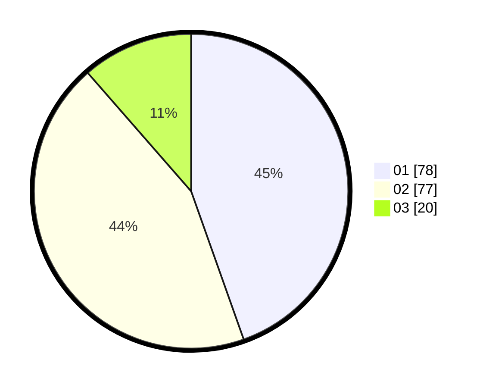

# Hasil

Hasil perolehan suara paslon dapat dilihat pada file paslon-01.txt, paslon-02.txt, dan paslon-03.txt.

Jika tidak ada, artinya data tersebut belum ada pada SIREKAP.

## Perolehan Suara

 * Paslon 01: **78**.
 * Paslon 02: **77**.
 * Paslon 03: **20**.

## Foto C Plano

https://sirekap-obj-formc.kpu.go.id/d98f/pemilu/ppwp/31/75/06/10/03/3175061003086-20240214-220531--2fd117e5-d40c-4a1e-946d-c8160dfe8a2f.jpg

https://sirekap-obj-formc.kpu.go.id/d98f/pemilu/ppwp/31/75/06/10/03/3175061003086-20240214-211015--4e9852ff-deeb-41d3-98f9-9123878c9280.jpg

https://sirekap-obj-formc.kpu.go.id/d98f/pemilu/ppwp/31/75/06/10/03/3175061003086-20240214-211126--0cb7e2cf-15e9-484f-a54b-ecfb20c32537.jpg
