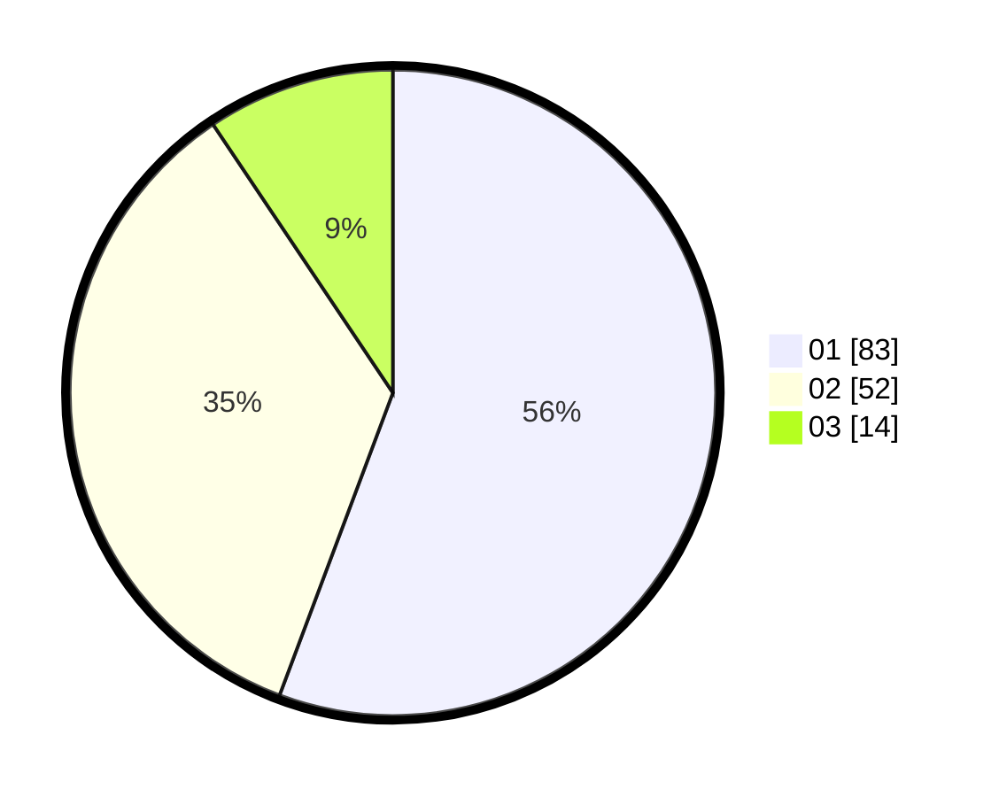

# Hasil

Hasil perolehan suara paslon dapat dilihat pada file paslon-01.txt, paslon-02.txt, dan paslon-03.txt.

Jika tidak ada, artinya data tersebut belum ada pada SIREKAP.

## Perolehan Suara

 * Paslon 01: **83**.
 * Paslon 02: **52**.
 * Paslon 03: **14**.

## Foto C Plano

https://sirekap-obj-formc.kpu.go.id/07ff/pemilu/ppwp/31/75/06/10/03/3175061003088-20240216-003243--d78b001f-979b-4bb0-b123-70833b7f2002.jpg

https://sirekap-obj-formc.kpu.go.id/07ff/pemilu/ppwp/31/75/06/10/03/3175061003088-20240214-195144--a746be54-6fd7-41a1-a4b9-76e96363ae01.jpg

https://sirekap-obj-formc.kpu.go.id/07ff/pemilu/ppwp/31/75/06/10/03/3175061003088-20240214-195618--6f3a378b-fae9-44fb-8bd6-97bada81bb58.jpg

## DATA PEMILIH TETAP

Jumlah pemilih dalam DPT: **245**.
 * L: **138**.
 * P: **107**.

## DATA PENGGUNA HAK PILIH

Jumlah pengguna hak pilih dalam DPT: **150**.
 * L: **74**.
 * P: **76**.

Jumlah pengguna hak pilih dalam DPTb: **0**.
 * L: **0**.
 * P: **0**.

Jumlah pengguna hak pilih dalam DPK: **2**.
 * L: **1**.
 * P: **1**.

Jumlah pengguna hak pilih: **152**.
 * L: **75**.
 * P: **77**.

## JUMLAH SUARA SAH DAN TIDAK SAH

JUMLAH SELURUH SUARA SAH: **149**.

JUMLAH SUARA TIDAK SAH: **3**.

JUMLAH SELURUH SUARA SAH DAN SUARA TIDAK SAH: **152**.
